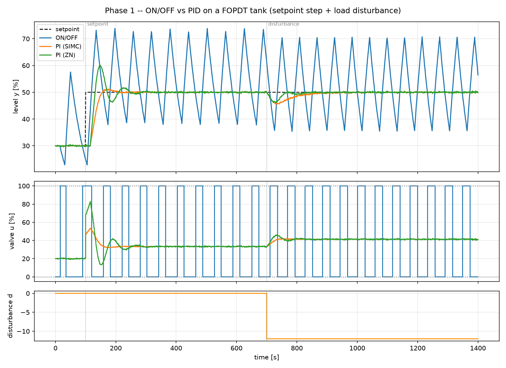
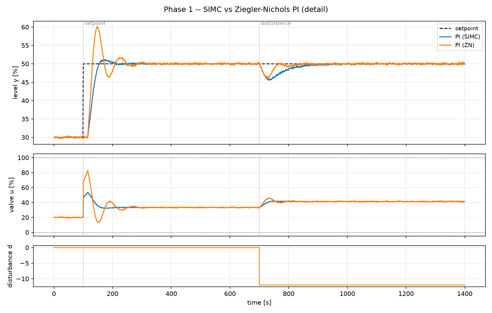

# 1. ON/OFF vs PID

!!! abstract "Headline"
    ON/OFF limit-cycles permanently at ±18 % of level with a period of ~4θ —
    and the dead time, not the deadband, sets both. SIMC PI settles with no
    offset. SIMC versus Ziegler–Nichols is a tracking-versus-effort trade, and
    neither is "better" until you say what the loop is for.

    **Reproduce:** `python experiments/exp01_onoff_vs_pid.py`

## The setup

| | |
|---|---|
| plant | `Tank(K=1.5, tau=60 s, theta=15 s, Kd=1.0)`, valve 0–100 % |
| noise | σ = 0.15 % level, seed 7 |
| sample time | 1 s |
| dead-time ratio | θ/τ = 0.25 |
| scenario | setpoint 30 → 50 % at t = 100 s; unmeasured load step d = −12 at t = 700 s |

Both PI tunings come from published rules applied to the **true** plant
parameters — the most generous possible setting for the baselines. Model
mismatch is phase 4's job, and it is introduced there deliberately.



## The numbers

| controller | window | IAE | settling (2 %) | overshoot | peak dev | TV(u) | reversals |
|---|---|---:|---:|---:|---:|---:|---:|
| ON/OFF (deadband 1 %) | setpoint | 5903 | never | 95 % | 27.1 | 1900 | 18 |
| ON/OFF | disturbance | 6294 | never | — | 20.8 | 2400 | 23 |
| PI, SIMC (τ_c = θ) | setpoint | 715 | 92 s | 6.0 % | 20.2 | 140 | 15 |
| PI, SIMC | disturbance | 411 | 153 s | — | 4.49 | 157 | 34 |
| PI, Ziegler–Nichols | setpoint | 902 | 142 s | 50.4 % | 20.1 | 309 | 108 |
| PI, Ziegler–Nichols | disturbance | 234 | 111 s | — | 3.93 | 284 | 156 |

## ON/OFF limit-cycles, as it must

The valve is either fully open or fully shut. Once the level crosses the
deadband, the process keeps moving for another θ seconds before the correction
even arrives — so the loop overshoots the band by an amount set by the dead
time, then repeats, forever.

Amplitude is **±18.0 %** of level (37.8–73.8 %) around a **1 %** deadband,
with a period of about **62 s ≈ 4θ**.

!!! quote "Read those two numbers together"
    The deadband is 1 % and the oscillation is 36 % peak-to-peak. The deadband
    is not what sets the amplitude — the dead time is. Tightening the deadband
    would not help; it would only make the switching faster.

Against SIMC PI, ON/OFF is 8× worse on IAE for the setpoint change, 15× worse
on the load disturbance, and 13–15× worse on valve travel. Its settling time
is correctly reported as `NaN`, because it never settles — see
[why that metric returns NaN](../concepts/metrics.md#the-three-that-need-care).

It has exactly one virtue, and it is not a small one: **it needs no model and
no tuning.**

??? note "When ON/OFF is nevertheless the right answer"
    A domestic thermostat, a compressor unloader, a level switch on a sump
    pump. The limit cycle is acceptable because nobody is grading the
    amplitude, and the alternative costs a modulating actuator and a
    commissioning visit. Where the *actuator* is binary but the amplitude is
    not acceptable, the answer is not a better ON/OFF controller — it is
    [time proportioning](../reference/controllers.md#timeproportioningcontroller),
    which pulses fast compared with the process and lets the process average.

## SIMC beats ZN on tracking and loses to it on load rejection

This is the trade the project exists to measure, and it shows up on the very
first experiment.

The ON/OFF limit cycle spans the whole axis, so the two PI traces are
unreadable on the combined plot. The experiment writes a second figure with
them on their own:



ZN's higher gain (Kc = 2.40 vs 1.33) buys:

- a **12 % smaller** disturbance peak (3.93 vs 4.49) and a considerably faster
  recovery — load IAE 234 against 411, and settling 111 s against 153 s;

and costs:

- **50 % overshoot** on the setpoint step, against 6 %;
- **2.2× the valve travel**, and 7× the reversals.

Neither is "better" without saying what the loop is for. If this were a real
mill loop, the SIMC tuning is the one that survives a valve maintenance
review. That judgement is made properly, across ten rules and against a
robustness axis, in [article 3](03-tuning-shootout.md).

## Reported honestly: there is nothing here for MPC to do

One input, one output, no active constraint, a dead-time ratio of 0.25 that a
PI handles comfortably, and a tracking error already down at the noise floor.

Phase 2 has to construct a scenario with an **active output constraint** before
MPC can show anything a PI cannot already do, and phase 3 has to introduce loop
interaction. Expect PID to remain the right answer for fast SISO loops
throughout — [fairness rule 4](../concepts/fairness.md).

## The code

```python
plant = Tank(K=1.5, tau=60.0, theta=15.0, Kd=1.0, h0=30.0,
             u_min=0.0, u_max=100.0, noise_std=0.15, seed=7)
scenario = setpoint_and_load(dt=1.0, y_start=30.0, y_step=50.0, seed=7)

simc = simc_pi(**plant.fopdt)
zn = ziegler_nichols_open_loop(**plant.fopdt, kind="PI")

controllers = {
    "ON/OFF": OnOffController(u_on=100.0, u_off=0.0, hysteresis=1.0),
    "PI (SIMC)": PIDController(**simc.as_kwargs(), ..., tuning_note=simc.rule),
    "PI (ZN)": PIDController(**zn.as_kwargs(), ..., tuning_note=zn.rule),
}
runs = run_all(plant, controllers, scenario)
```

Full script: [`experiments/exp01_onoff_vs_pid.py`](https://github.com/josepbf/process-control-toolbox/blob/main/experiments/exp01_onoff_vs_pid.py).
The step-by-step version is [Tutorial 1](../tutorials/01-your-first-loop.md).

## Next

[Article 2: integral windup](02-integral-windup.md) — where the difference
between a usable and an unusable loop has nothing to do with Kc or Ti.
