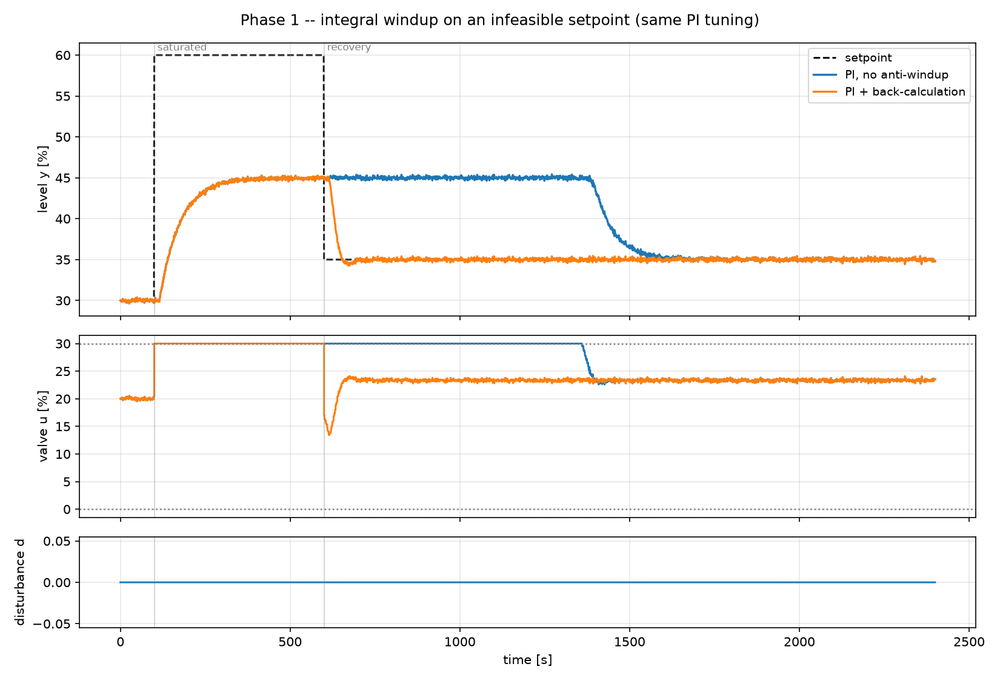

# 2. Integral windup

!!! abstract "Headline"
    Same plant, same SIMC tuning, same seed. The only difference is whether
    the integrator knows the valve is saturated. **16× on recovery IAE** — a
    structural fix, not a tuning one.

    **Reproduce:** `python -m experiments.exp02_antiwindup`

## The setup

The plant and the tuning are exactly those of [article 1](01-onoff-vs-pid.md),
with one change: the valve is **mechanically limited to 30 %**, so the maximum
attainable level is 45 %.

The setpoint is then driven to an infeasible **60 %**, held for 500 s, and
dropped to 35 %.

```python
plant = Tank(K=1.5, tau=60.0, theta=15.0, h0=30.0,
             u_min=0.0, u_max=30.0,      # y_max_feasible = 45 %
             noise_std=0.15, seed=7)

scenario = Scenario(
    setpoint=staircase([(0.0, 30.0), (100.0, 60.0), (600.0, 35.0)]),
    windows={"saturated": (100.0, 600.0), "recovery": (600.0, 2400.0)},
    ...,
)
```

Both controllers get the **identical** SIMC tuning. The only difference is one
constructor argument:

```python
"PI, no anti-windup":    PIDController(**common, Tt=np.inf, ...)   # integrator blind to saturation
"PI + back-calculation": PIDController(**common, ...)              # Tt = Ti (Astrom & Hagglund)
```



## The numbers

| controller | recovery IAE | recovery settling | valve travel during saturation |
|---|---:|---:|---:|
| PI, no anti-windup | 8573 | 972 s | 0 |
| PI + back-calculation | 538 | 49 s | 13.0 |

**16× difference in recovery IAE**, and 20× in settling time.

## What actually happens

When the valve is at a limit, **the loop is open**: the error persists but the
actuator cannot answer it. A naive integrator keeps accumulating anyway.

The naive integrator accumulates for the whole 500 s of saturation. When the
setpoint becomes reachable again at t = 600 s, the controller sits pinned at
the limit for a further **~800 s**, unwinding a fictitious integral before the
valve moves at all. The level stays 10 % above target that entire time.

### The last column is the interesting one

`13.0` versus `0` valve travel *during the saturated window* looks like
noise-chasing. It is the whole mechanism.

With back-calculation, the integrator is fed the amount by which the requested
move was clipped, divided by a tracking time constant `Tt`:

```python
self._integral += self.Kc * (self.dt / self.Ti) * e
self._integral += (self.dt / self.Tt) * (u_sat - u_unsat)   # <- the fix
```

That bleeds the integral back to a feasible value, so it **parks at the
saturation boundary**. The valve is then one sample away from responding —
hence the small non-zero travel while it tracks the boundary.

The naive integrator is buried far inside windup and is, in effect,
**disconnected** from the process. Its zero travel is not stillness; it is a
controller that has stopped being a controller.

!!! note "Why `Tt = Ti`"
    Åström's rule of thumb: `Tt = sqrt(Ti*Td)` for PID, `Tt = Ti` for PI.
    Fast enough to unwind promptly, slow enough not to cripple integral
    action. `PIDController` picks it automatically when you do not pass one.

## The industrial reading

The difference between a usable and an unusable loop here has **nothing to do
with Kc or Ti**. Both controllers are tuned by the same published rule to the
same two numbers.

!!! danger "The point for the whole project"
    Any comparison that tunes PID carefully but leaves anti-windup out is not
    comparing control laws — it is comparing a correct implementation against
    a broken one. And constrained operation is exactly the regime where any
    constraint-aware controller is
    supposed to be judged.

    This is why [fairness rule 1](../concepts/fairness.md) is not enough on
    its own. A cited tuning rule guarantees the *numbers* are defensible; it
    guarantees nothing about the implementation they are plugged into.

## The two correct fixes

The project implements both, and they are worth knowing as alternatives.

=== "Back-calculation (positional form)"

    `PIDController`. Bolt-on: the integrator is fed its own clipping error.
    Needs `u_min` / `u_max` and a tracking time constant `Tt`.

    Used everywhere in this project because it is explicit — you can see the
    fix in the source and switch it off, which is what makes this experiment
    possible.

=== "The velocity form"

    `VelocityPIDController`. Structural: there is no integral state to run
    away, because the integral lives in `u_{k-1}`, which is clipped every
    sample. Anti-windup is a property of the form rather than a bolt-on, and
    bumpless manual-to-auto transfer comes free.

    This is what most DCS and PLC function blocks actually implement. The
    trade-off is that derivative action becomes a second difference and so is
    more noise-sensitive.

The same failure recurs one level up in a cascade — if the secondary hits a
valve limit, the primary must stop integrating too. `CascadeController` handles
it by giving the primary output limits equal to the achievable range of the
inner setpoint, so its own back-calculation does the work. See
[article 7](07-cascade.md).

And once more in [Tutorial 5](../tutorials/05-writing-a-controller.md), where a
rate limiter downstream of a PI reproduces the bug in miniature — 6 % overshoot
becomes 72 %.

## Next

[Article 3: the tuning shootout](03-tuning-shootout.md) — now that the
implementation is correct, which tuning rule is the fair baseline?
