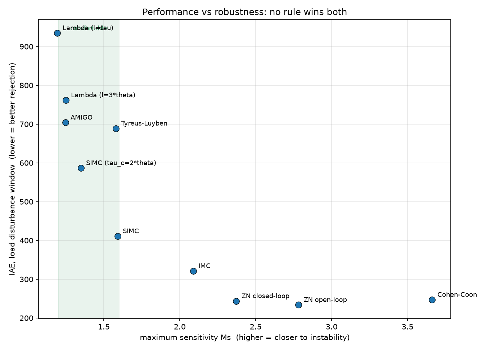
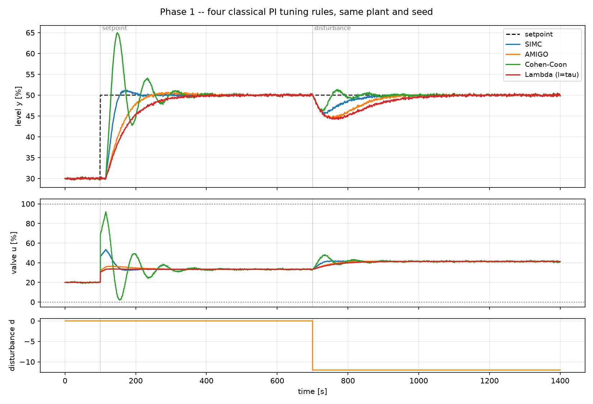

# 3. The tuning shootout

!!! abstract "Headline"
    Ten published PI rules, one plant, one scenario, one seed — scored on
    time-domain performance **and** on maximum sensitivity Ms. There is no
    rule that is simply better; there is a frontier. SIMC with τ_c = θ sits at
    the knee, and is adopted as the project's PID baseline on that stated
    ground.

    **Reproduce:** `python -m experiments.exp03_tuning_shootout`

## Why this experiment exists

Any comparison against PID turns on which PID you compare against,
and "tuned by a named rule" is not by itself enough — **the named rules
disagree with each other by a factor of 4.6 in gain.**

So the baseline gets picked here, in public, on stated grounds, before any
contender exists to be flattered by the choice.

Plant: `K = 1.5, τ = 60 s, θ = 15 s`, the same scenario as
[article 1](01-onoff-vs-pid.md). Robustness computed with
`pid_on_fopdt()` — see [Robustness](../concepts/robustness.md).

## The numbers

Sorted by Ms, most robust first:

| rule | Kc | Ti | Ms | GM | PM | IAE setpoint | overshoot | IAE load | TV(u) |
|---|---:|---:|---:|---:|---:|---:|---:|---:|---:|
| Lambda (λ=τ) | 0.53 | 60.0 | 1.19 | 7.85 | 79° | 1519 | 1.9 % | 935 | 116 |
| AMIGO | 0.61 | 49.2 | 1.25 | 6.71 | 70° | 1209 | 3.4 % | 704 | 132 |
| Lambda (λ=3θ) | 0.67 | 60.0 | 1.25 | 6.28 | 76° | 1229 | 1.9 % | 761 | 144 |
| SIMC (τ_c=2θ) | 0.89 | 60.0 | 1.35 | 4.71 | 71° | 942 | 2.0 % | 587 | 193 |
| Tyreus–Luyben | 1.44 | 120.9 | 1.58 | 3.06 | 74° | 1096 | 1.4 % | 689 | 321 |
| **SIMC (τ_c=θ)** | **1.33** | **60.0** | **1.59** | **3.14** | **61°** | **715** | **6.0 %** | **411** | **297** |
| IMC | 2.00 | 67.5 | 2.09 | 2.12 | 49° | 717 | 23.8 % | 321 | 465 |
| ZN closed-loop | 2.08 | 45.8 | 2.37 | 1.93 | 39° | 837 | 40.8 % | 244 | 499 |
| ZN open-loop | 2.40 | 50.0 | 2.78 | 1.70 | 35° | 902 | 50.4 % | 234 | 593 |
| Cohen–Coon | 2.46 | 33.0 | 3.66 | 1.51 | 23° | 1266 | 74.6 % | 247 | 663 |





## Three things fall out

### 1. The load-rejection axis is monotone in Ms — and so is the valve wear

IAE on the load disturbance improves by **4×** from the most robust rule to
the least (935 → 234). Valve travel worsens by **5.7×** over the same span
(116 → 663).

There is no rule that is simply better. There is a **frontier**, and choosing
a point on it is an engineering decision about how much model error the plant
is expected to develop — how much the gain will drift with tonnage, moisture,
or liner wear between now and the next commissioning visit.

### 2. Setpoint tracking is not monotone — it has an optimum

IAE on the setpoint step falls from 1519 to a minimum of **715 at SIMC**, then
*rises again* to 1266 at Cohen–Coon. Past a certain gain, the overshoot costs
more than the speed gains.

!!! quote "Which is why"
    "We tuned the PID aggressively" is not the same statement as "we tuned the
    PID well". Cohen–Coon is both the highest-gain rule in the table and among
    the *worst* setpoint trackers in it.

### 3. SIMC with τ_c = θ sits at the knee

And that is the ground on which it is adopted as the standard PID baseline for
the rest of the project:

- the **best setpoint IAE** of any rule tested (715);
- the second-best load IAE **inside the comfortable robustness band**;
- GM 3.1 / PM 61° / Ms 1.59 — matching the robustness Skogestad reports for
  the rule.

Where a *robust* baseline is wanted instead, **AMIGO** (Ms 1.25) is the one to
use. Both appear in later comparisons, rather than one being quietly chosen
after the fact.

## A calibration note for the whole project

Cohen–Coon and Ziegler–Nichols are included because they are what most people
picture when they hear "tuned PID". They land at **Ms 2.8–3.7** — loops that
will oscillate the first time the process gain moves.

!!! danger
    Benchmarking anything against *those* would be flattering and meaningless.
    Any published comparison whose PID baseline shows 40–75 % overshoot on a
    setpoint step is, whether or not it says so, comparing against a rule from
    1942 or 1953 that was targeting quarter-amplitude decay — a taste, not a
    robustness specification.

## Reading the tuning rules themselves

Why Lambda is so conservative, why SIMC caps `Ti`, what AMIGO was fitted
to: [Concepts → Tuning rules](../concepts/tuning-rules.md).

The short version of the two most instructive rows:

- **Lambda (λ=τ)** sets `Ti = tau` exactly, cancelling the process lag. That
  gives a clean first-order setpoint response and, on a lag-dominant process,
  poor load rejection — the integral is far slower than the disturbance. It is
  the DCS default in pulp, paper and cement, and this table is the price.
- **SIMC** sets `Ti = min(tau, 4*(tau_c + theta))`. The `min` is the important
  half of the rule, and it is precisely the fix for Lambda's problem.

## The code

```python
rules = {
    "SIMC":                simc_pi(**p),
    "SIMC (tau_c=2*theta)": simc_pi(**p, tau_c=2 * p["theta"]),
    "IMC":                 imc_pi(**p),
    "Lambda (l=tau)":      lambda_tuning(**p),
    "Lambda (l=3*theta)":  lambda_tuning(**p, lam=3 * p["theta"]),
    "AMIGO":               amigo_pi(**p),
    "ZN open-loop":        ziegler_nichols_open_loop(**p, kind="PI"),
    "Cohen-Coon":          cohen_coon(**p, kind="PI"),
    "ZN closed-loop":      ziegler_nichols_closed_loop(Ku, Pu, kind="PI"),
    "Tyreus-Luyben":       tyreus_luyben(Ku, Pu, kind="PI"),
}

for label, t in rules.items():
    rob = pid_on_fopdt(**p, Kc=t.Kc, Ti=t.Ti)      # Ms, GM, PM
    ...
```

`Ku` and `Pu` come from `ultimate_gain_period(**p)` — the analytic values. On
a real plant you would get them from a relay test, which is
[article 4](04-relay-autotune.md).

Full script: [`experiments/exp03_tuning_shootout.py`](https://github.com/josepbf/process-control-toolbox/blob/main/experiments/exp03_tuning_shootout.py).

## Next

[Article 4: relay auto-tuning](04-relay-autotune.md) — the same two closed-loop
numbers, obtained without a model, the way the plant actually does it.
