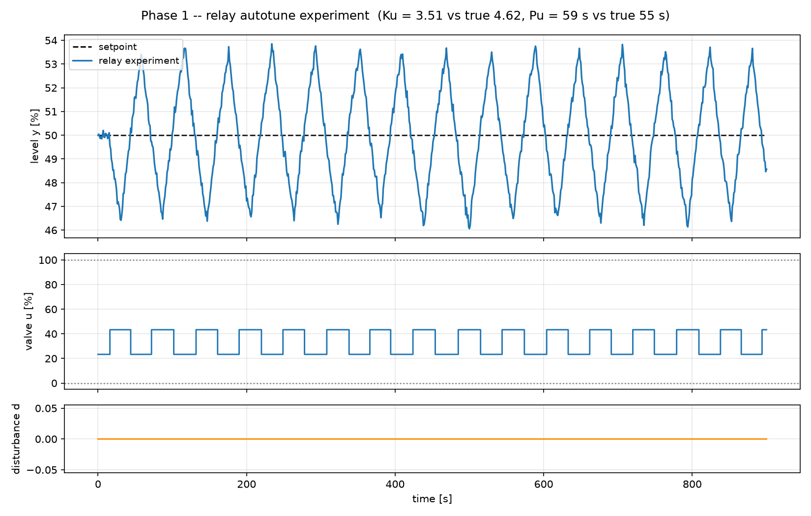
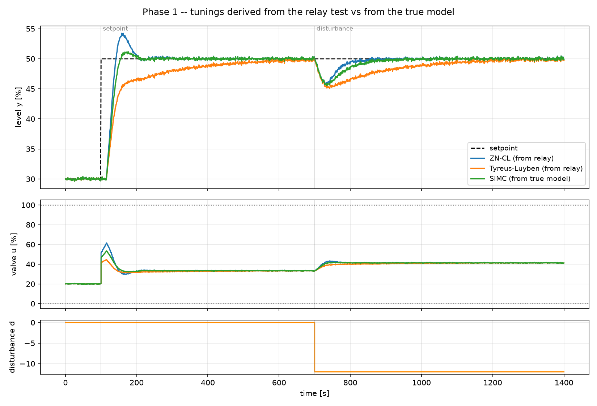

# 4. Relay auto-tuning

!!! abstract "Headline"
    Åström & Hägglund's 1984 relay experiment recovers the ultimate period to
    **+7 %** and under-gains by **24 %**. The error direction is safe. An
    autotune gets you into the right neighbourhood with no model at all —
    and the model-based rule still wins.

    **Reproduce:** `python experiments/exp04_relay_autotune.py`

## What the experiment is

The closed-loop tuning rules need $K_u$ and $P_u$. Ziegler and Nichols'
original way to get them was to raise the gain until the plant oscillated — a
deliberate walk to the edge of instability on live equipment.

The relay experiment replaces the controller with a relay of amplitude $h$.
The loop settles into a limit cycle at the frequency where the process has
−180° of phase, which is the ultimate frequency by definition. The oscillation
is **bounded** — its amplitude is set by the relay amplitude you chose.

The mechanics, the hysteresis, and the failure modes are in
[Tutorial 3](../tutorials/03-relay-autotuning.md). This article is about how
good the answer is.

```python
relay = relay_autotune(
    plant, setpoint=50.0, u_bias=plant.steady_input(50.0),
    h=10.0,             # 10 % of valve travel
    hysteresis=0.5,     # ~3 sigma of the measurement noise
    dt=1.0, t_final=900.0, seed=7,
)
```



## How accurate is it?

The plant's ultimate values are known analytically
(`ultimate_gain_period()`), so the error can be measured rather than guessed.

| | ultimate gain Ku | ultimate period Pu |
|---|---:|---:|
| relay experiment | 3.51 | 58.7 s |
| analytic truth | 4.62 | 54.9 s |
| **error** | **−24 %** | **+7 %** |

**The experiment gets the period nearly right and the gain conservatively
wrong**, and both are explainable rather than incidental.

**The period.** The limit cycle sits at the −180° phase frequency, so $P_u$ is
close *by construction*. The residual +7 % is the phase lag of the hysteresis
— the relay waits before switching, so the cycle is slightly slower than the
true ultimate frequency. Run without hysteresis on a noise-free plant and the
error falls to **+2 %**.

**The gain.** $K_u$ comes from a describing-function approximation that keeps
only the fundamental of the relay's square wave. That assumes the process
filters the harmonics well; with θ/τ = 0.25 it does so imperfectly. **The
error direction is safe: it under-gains.**

## What you get if you tune from it

| tuning | needs a model? | Ms | IAE setpoint | IAE load |
|---|---|---:|---:|---:|
| ZN closed-loop (from relay) | no | 1.82 | 759 | 309 |
| Tyreus–Luyben (from relay) | no | 1.39 | 1521 | 962 |
| SIMC (from the true model) | yes | 1.59 | 715 | 411 |



**An autotune gets you into the right neighbourhood without a model at all.**
That is a real result, and it is the reason the button exists on essentially
every industrial controller.

**The model-based rule still wins.** SIMC matches ZN-CL's setpoint tracking
(715 vs 759) at meaningfully better robustness (Ms 1.59 vs 1.82).

**Tyreus–Luyben pays 2.3× the load IAE for its safety** (962 vs 411). It is
the rule most autotuners actually ship, and this row is why: it lands at
Ms 1.39, comfortably inside process practice, where ZN's 1.82 does not. An
autotuner has to produce a setting that is safe on a plant nobody has looked
at, and Tyreus–Luyben is the rule that does that.

!!! note "The compounding error"
    Note what happened to the two errors. The relay under-gains $K_u$ by 24 %,
    and Tyreus–Luyben then applies its own conservatism on top ($K_c = K_u/3.2$
    and $T_i = 2.2 P_u$). The result is a very safe loop that is very slow —
    the two conservatisms multiply rather than cancel.

    This is a general property of stacking safety margins, and it is worth
    keeping in mind when an MPC's model is identified from plant data and then
    handed to a controller that also has a robustness weight.

## What this sets up for later phases

The gap between "no model" and "a model" is visible here as roughly a factor
of two in load-disturbance IAE, on a plant where the model was exact.

**Phase 4 prices that gap properly**, with deliberate model mismatch: PRBS
identification, ARX and subspace fits, and mismatch sweeps. The question there
is the one this experiment only gestures at — *how good does a model have to
be before it is worth having?*

## The code

```python
plant = Tank(K=1.5, tau=60.0, theta=15.0, h0=50.0, noise_std=0.15, seed=7)

relay = relay_autotune(plant, setpoint=50.0, u_bias=plant.steady_input(50.0),
                       h=10.0, hysteresis=0.5, dt=1.0, t_final=900.0, seed=7)
Ku_true, Pu_true = ultimate_gain_period(**plant.fopdt)

rules = {
    "ZN-CL (from relay)":         ziegler_nichols_closed_loop(relay.Ku, relay.Pu, kind="PI"),
    "Tyreus-Luyben (from relay)": tyreus_luyben(relay.Ku, relay.Pu, kind="PI"),
    "SIMC (from true model)":     simc_pi(**plant.fopdt),
}
```

Full script: [`experiments/exp04_relay_autotune.py`](https://github.com/josepbf/process-control-toolbox/blob/main/experiments/exp04_relay_autotune.py).

## Next

[Article 5: the dead-time sweep](05-dead-time-sweep.md) — where feedback runs
out of road, and how much room is left for anything better.
