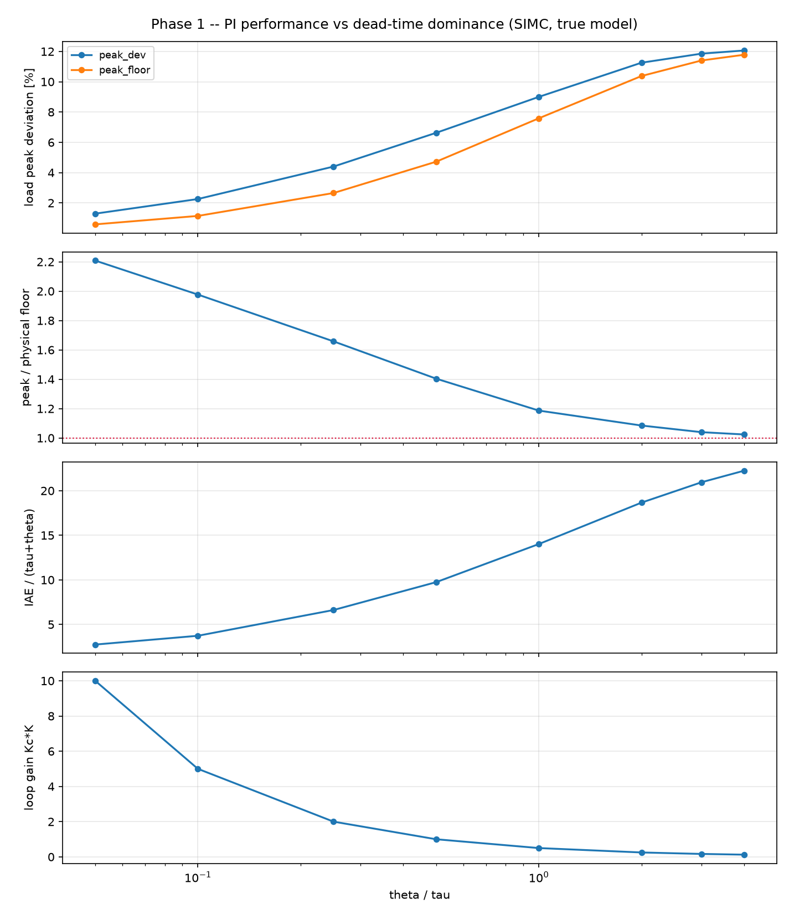
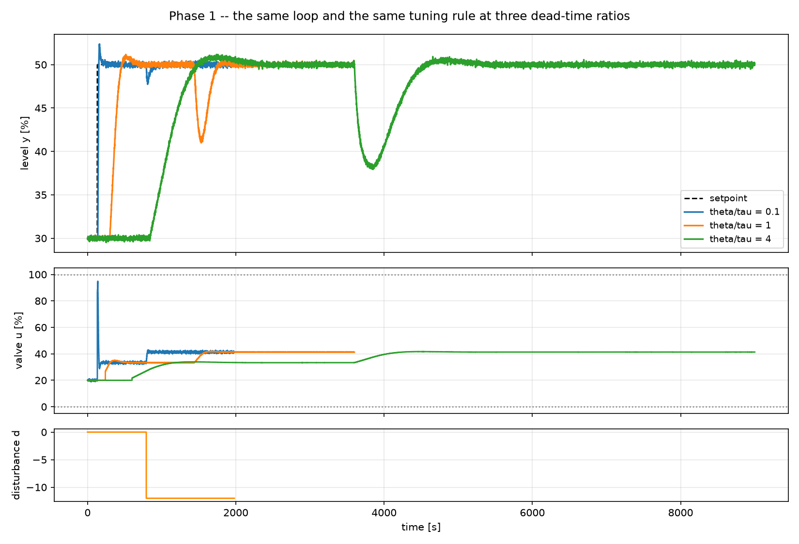

# 5. The dead-time sweep

!!! abstract "Headline"
    τ held fixed, θ swept over two decades, the same tuning rule applied
    throughout. Usable loop gain collapses **80×** while Ms stays pinned at
    1.59 — and the achieved peak deviation converges on a physical floor no
    controller can beat. Dead time costs you two different things, and only
    one of them is available to be won back.

    **Reproduce:** `python -m experiments.exp05_deadtime_sweep`

## Why this is the most important phase-1 experiment

This is the setup experiment for everything the project is about. The ratio
θ/τ is the single best predictor of how hard a loop is (see
[Dead time](../concepts/dead-time.md)), and a cement mill or a kiln lives above
1 — exactly where dead-time compensation and prediction are supposed to earn
their keep.

Running it *before* any dead-time-compensating controller exists sets the
expectation quantitatively. That is the point.

## The setup

Everything is held fixed except θ:

| held fixed | swept |
|---|---|
| K = 1.5, τ = 60 s, Kd = 1.0 | θ, over θ/τ ∈ [0.05, 4] |
| load disturbance d = −12 | |
| tuning rule: SIMC, τ_c = θ, on the true model | |
| seed, sample time | |

!!! tip "Scaling the scenario with the process"
    Every time in the scenario is a multiple of `tau + theta`:

    ```python
    scale = TAU + theta
    scenario = setpoint_and_load(t_step=2 * scale, t_load=12 * scale,
                                 t_final=30 * scale, ...)
    ```

    so each case gets the same number of process time constants to respond in.
    Without that, the slow cases would be scored on runs that ended before
    they settled, and part of the "degradation" would be an artefact of the
    run length. IAE is likewise divided by `scale` before cases are compared.

## The physical floor

After a load step, **no controller can affect the output for θ seconds**,
because its move takes that long to arrive. The unavoidable peak deviation is
therefore at least

\[
|K_d \, d| \left(1 - e^{-\theta/\tau}\right)
\]

This is the dashed line in the figure. The gap between the PI curve and that
line is what better control could in principle recover; where the two meet,
the loss is physics.



## The numbers

| θ/τ | loop gain Kc·K | Ms | load peak | physical floor | peak / floor | IAE/(τ+θ) |
|---:|---:|---:|---:|---:|---:|---:|
| 0.05 | 10.0 | 1.65 | 1.29 | 0.59 | 2.21 | 2.7 |
| 0.10 | 5.00 | 1.61 | 2.26 | 1.14 | 1.98 | 3.7 |
| 0.25 | 2.00 | 1.59 | 4.40 | 2.65 | 1.66 | 6.6 |
| 0.50 | 1.00 | 1.59 | 6.63 | 4.72 | 1.40 | 9.7 |
| 1.0 | 0.50 | 1.59 | 9.00 | 7.59 | 1.19 | 14.0 |
| 2.0 | 0.25 | 1.59 | 11.26 | 10.38 | 1.09 | 18.7 |
| 3.0 | 0.167 | 1.59 | 11.85 | 11.40 | 1.04 | 20.9 |
| 4.0 | 0.125 | 1.59 | 12.06 | 11.78 | **1.02** | 22.2 |



## Usable loop gain collapses 80× — and the rule is right to let it

Kc·K falls from 10.0 to 0.125 while **Ms stays pinned at 1.59** across almost
the whole sweep.

The tuning rule is not getting worse. The process is getting harder, and the
rule is correctly refusing to buy performance it cannot pay for. Every one of
those eight loops has the same distance from the −1 point; they just achieve
progressively less with it.

!!! note "Why Ms drifts slightly at the fast end"
    At θ/τ = 0.05 and 0.10, Ms comes out at 1.65 and 1.61 rather than 1.59.
    That is the `min` in SIMC's `Ti` rule biting: `Ti = min(tau, 4*(tau_c +
    theta))` selects the second branch when θ is small, changing the shape of
    the loop transfer function slightly. Everywhere else `Ti = tau`, and Ms is
    identical to twelve significant figures.

## The finding that matters

As dead time takes over, PI gets **closer** to the physical floor on peak
deviation — 2.21× the floor at θ/τ = 0.05, but **1.02×** at θ/τ = 4 — while
scaled IAE gets **8× worse**.

So dead time costs you two different things:

<div class="grid cards" markdown>

-   :material-lock:{ .lg .middle } __The peak deviation — physics__

    ---

    No control law recovers it, however sophisticated. In the dead-time-dominant
    regime there is essentially nothing left to win here: PI is already within
    2 % of the theoretical limit.

-   :material-trending-up:{ .lg .middle } __The recovery — control__

    ---

    Scaled IAE degrades 8× across the sweep and never approaches any bound.
    **All of the remaining headroom is here.**

</div>

!!! danger "The falsifiable claim this sets up"
    Any later claim that a Smith predictor or a predictive controller "handles dead time
    better" has to show up in the **second** of those, not the first.

    A comparison that reports a smaller peak deviation in the
    dead-time-dominant regime is either measuring something other than what it
    says, or has given the sophisticated controller information the baseline
    did not have. This table is the check.

## What is *not* being claimed

This sweep tunes SIMC on the **true model** at every point, and applies no
dead-time compensation. It is therefore a floor on how well classical feedback
does, not a ceiling:

- a **Smith predictor** would be the honest classical contender above θ/τ = 1,
  and is next on the roadmap;
- any predictive scheme's advantage has to be demonstrated against the recovery
  metric, with the internal model deliberately imperfect.

## The code

```python
def run_one(ratio):
    theta = ratio * TAU
    plant = Tank(K=K, tau=TAU, theta=theta, Kd=1.0, h0=30.0, noise_std=0.15, seed=7)

    scale = TAU + theta                       # scenario scales with the process
    scenario = setpoint_and_load(t_step=2 * scale, t_load=12 * scale,
                                 t_final=30 * scale, d_load=D_LOAD, seed=7)

    tuning = simc_pi(**plant.fopdt)
    df = simulate(plant, PIDController(**tuning.as_kwargs(), ...), scenario)

    floor = abs(plant.Kd * D_LOAD) * (1.0 - np.exp(-theta / TAU))
    ...
```

Full script: [`experiments/exp05_deadtime_sweep.py`](https://github.com/josepbf/process-control-toolbox/blob/main/experiments/exp05_deadtime_sweep.py).
The sweep-and-plot pattern is documented in
[Tutorial 6](../tutorials/06-designing-an-experiment.md#pattern-2-a-parameter-sweep).

## Next

[Article 6: averaging level control](06-averaging-level.md) — a step back from
"how well", to ask what the loop is supposed to be doing at all.
