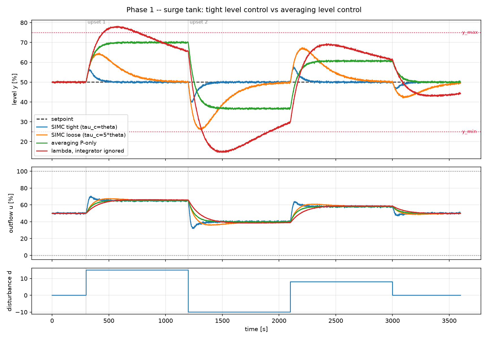

# 6. Averaging level control

!!! abstract "Headline"
    Four controllers on a surge tank. Judged on level deviation, tight tuning
    wins by 2.4×. Judged on outflow variability — what the downstream unit
    actually feels — it is the **worst of the four** by 3.3×. Both columns are
    true. Which one is the objective is a question about the plant, not about
    control theory.

    **Reproduce:** `python -m experiments.exp06_averaging_level`

## The setup

An integrating level process — a surge tank between two units — with the tank
**outflow** as the manipulated variable and the inflow as the disturbance.

| | |
|---|---|
| plant | `IntegratingTank(k'=−0.02 %/s per % valve, θ=10 s)` |
| noise | σ = 0.2 %, seed 7 |
| alarm band | 25–75 % (reporting-only) |
| disturbance | inflow steps +15, −10, +8, 0 |
| setpoint | held at 50 % throughout |

`k'` is negative because opening the outflow valve *lowers* the level, so
every tuning below comes out reverse acting.

!!! info "Why an integrating process needs its own rules"
    A self-regulating process settles somewhere on its own when you leave the
    valve alone. An integrating one does not — the level ramps until something
    stops it. Surge tanks, drum levels, silos, mill hold-ups and kiln beds all
    behave this way, and they are the most common loop in a plant.

    There is no `tau` to cancel, so any rule that sets `Ti` from a process lag
    is meaningless here. The fourth controller in the table does exactly that,
    on purpose.



## The numbers

| controller | Kc | Ti | Ms | peak level dev | TV(outflow) | alarm violations |
|---|---:|---:|---:|---:|---:|---:|
| SIMC tight (τ_c=θ) | −2.50 | 80 | 1.70 | **10.1** | 1862 | 0 |
| SIMC loose (τ_c=5θ) | −0.83 | 240 | 1.17 | 24.0 | 635 | 0 |
| averaging P-only | −0.75 | — | 1.14 | 20.5 | **570** | 0 |
| lambda, integrator ignored | −0.46 | 1000 | 1.09 | 35.4 | 353 | **890** |

## The two rankings are opposite

On **level deviation**, the tight tuning wins by 2.4×.

On **outflow variability** — what the downstream unit actually experiences —
it is the worst of the four by 3.3×.

!!! quote "The engineering reading"
    A surge tank is installed to give the downstream unit a steady feed. A
    controller that holds level perfectly has passed every inflow upset
    straight through and **removed the reason the tank was built**.

    Both columns are true. Which one is the objective is a question about the
    plant, not about control theory, and it has to be answered before any
    comparison means anything.

This is the clearest phase-1 example of a rule the whole project runs on: a
control comparison is meaningless until the objective is stated, and "tracking
error" is not automatically the objective.

## Averaging level control is a different design, not a detuned one

```python
averaging_level_pi(k_prime=-0.02, v_max=15.0, y_max_dev=20.0)
# Kc = sign(k') * v_max / y_max_dev = -0.75, P-only
```

The design question is not "how tightly can I hold this level" but "what is
the **loosest** proportional gain that still keeps the level inside its alarm
band for the largest expected flow upset?" That is a one-line calculation, and
it is P-only — integral action would defeat the purpose by eventually
returning the level to setpoint and passing the upset through anyway.

Compare the loose SIMC row: nearly the same Ms and outflow variability, but a
*worse* peak level deviation, because it is still trying to return to setpoint
and using tank capacity to do it. The averaging design uses the same capacity
to absorb the upset instead.

## The second finding: a sharper warning about single-number robustness

**The worst controller in the table has the lowest Ms** (1.09).

It earns that by being detuned into uselessness. It spends **890 samples
outside the alarm band** — the only row in the table that violates anything at
all.

!!! danger
    Ms bounds how close a loop is to instability. It says **nothing** about
    whether the loop is doing its job.

    Robustness and performance both have to be reported, and this row is the
    counterexample to reading either one alone. See
    [Robustness](../concepts/robustness.md#the-counterexample-why-ms-is-never-read-alone).

That fourth controller is also the classic field mistake, constructed
deliberately: applying a self-regulating (FOPDT) tuning rule to an integrating
process by pretending the integrator is a very slow lag.

```python
tau_fake = 1000.0
wrong = lambda_tuning(K=k_prime * tau_fake, tau=tau_fake, theta=10.0, lam=100.0)
# Ti = 1000 s -- an integral time set from a lag that does not exist
```

It produces `Ti = 1000 s` and the slow rolling oscillation seen in level loops
in every plant on earth.

## The code

```python
plant = IntegratingTank(k_prime=-0.02, u_bias=50.0, theta=10.0, Kd=0.02,
                        h0=50.0, noise_std=0.2,
                        y_min=25.0, y_max=75.0, seed=7)

p = plant.integrating                      # {'k_prime': -0.02, 'theta': 10.0}
rules = {
    "SIMC tight (tau_c=theta)":   simc_integrating(**p, tau_c=p["theta"]),
    "SIMC loose (tau_c=5*theta)": simc_integrating(**p, tau_c=5 * p["theta"]),
    "averaging P-only":           averaging_level_pi(k_prime=p["k_prime"],
                                                     v_max=15.0, y_max_dev=20.0),
    "lambda, integrator ignored": wrong,
}
```

Robustness comes from `pid_on_integrator()` rather than `pid_on_fopdt()` — the
loop transfer function has a $1/s$ in it, and using the FOPDT version here
would be the same category error the fourth controller makes.

Full script: [`experiments/exp06_averaging_level.py`](https://github.com/josepbf/process-control-toolbox/blob/main/experiments/exp06_averaging_level.py).

## Next

[Article 7: cascade control](07-cascade.md) — the first of two experiments
where the win comes from **structure** rather than tuning.
