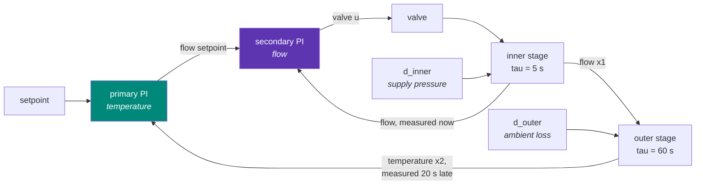
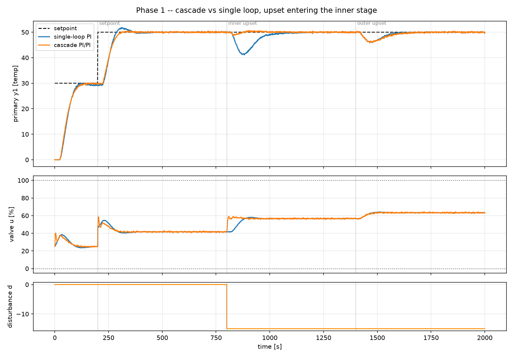

# 7. Cascade control

!!! abstract "Headline"
    One extra measurement, nothing else changed. **7.7× better** on the
    disturbance cascade was designed for, **0.9× — worse** — on the one it was
    not, at **2.1× the valve travel** throughout. The negative result is as
    important as the positive one.

    **Reproduce:** `python experiments/exp07_cascade.py`

## The structure



The primary controller's **output is not a valve position** — it is the
setpoint handed to a second, faster controller closing its own loop on an
intermediate measurement.

## The setup

| | |
|---|---|
| inner stage | valve → flow, K₁ = 1.0, τ₁ = 5 s, **measured immediately** |
| outer stage | flow → temperature, K₂ = 1.2, τ₂ = 60 s, **measured 20 s late** |
| dead time | 2 s on the valve |
| noise | σ = (0.15 primary, 0.25 secondary), seed 7 |
| τ₂/τ₁ | 12 (the rule of thumb wants ≥ 3–5) |

The disturbance is deliberately placed in the **inner stage** — a supply
pressure change, so the same valve position now delivers a different flow.
This is the case cascade was invented for.

!!! note "What is *not* being changed"
    The plant, the actuator limits, the sample time, the seed, and the tuning
    method are all identical. The only difference is one extra measurement.

    That is the honest way to price a structural change — and it is the same
    accounting MPC will be put through in later phases.

Both controllers are SIMC-tuned. The cascade is tuned in the standard order:
inner loop first and tight, then the outer loop against the *closed* inner
loop, approximated as unity gain with its closed-loop lag folded into the
dead time.



## The numbers

| disturbance location | single-loop PI | cascade PI/PI | ratio |
|---|---:|---:|---:|
| inner stage — IAE | 909 | 118 | **7.7×** |
| inner stage — peak deviation | 8.90 | 1.24 | **7.1×** |
| inner stage — settling | 239 s | 57 s | 4.2× |
| outer stage — IAE | 429 | 471 | **0.9× (worse)** |
| setpoint — IAE | 1211 | 1153 | 1.05× |
| valve travel TV(u) | 111 | 236 | **2.1× worse** |

## Why it works: information, not gain

A disturbance entering the inner stage moves the flow the valve delivers. A
single loop measuring only temperature cannot know anything has happened until
the upset has worked its way through the **60 s** outer lag — by which time
the temperature has already moved, and the 20 s measurement delay means the
controller does not even see *that* for another 20 s.

The secondary controller sees the flow change within its own **5 s** time
constant and corrects it before the primary variable is affected at all.

!!! quote
    Cascade is not a tuning trick. It buys information, by adding a
    measurement.

The asymmetry that makes it work is the **measurement**, not the dynamics: the
primary is reported 20 s late and the secondary is not. That is the practical
reason a cascade pays for its extra transmitter, and it is why
[`CascadeProcess`](../reference/plants.md#cascadeprocess) models measurement
dead time as a first-class thing.

A second benefit, not measured here: nonlinearity in the actuator (valve
characteristic, hysteresis) is absorbed by the inner loop, so the outer loop
sees a much closer-to-linear process.

## Why the negative result matters more

The outer-stage upset **never passes through the inner loop**, so the extra
measurement carries no information about it — and the cascade is marginally
*worse* there (0.9×), because the outer controller is now working through an
extra loop rather than acting on the valve directly.

!!! danger "This is the correct shape for a structural change"
    It buys a **specific** thing. Reporting only the case where it wins would
    be the same sleight of hand this project is trying to avoid for MPC.

    See [fairness rule 4](../concepts/fairness.md#4-scenarios-where-the-sophisticated-method-loses-get-reported).

## And it costs valve travel

**2.1×**, throughout — including on the setpoint change and the outer upset,
where cascade buys nothing. The inner loop is tuned tight and is closing on a
noisier measurement (σ = 0.25 against 0.15), so it moves the valve constantly.

On a real plant that is a maintenance conversation. It is usually worth having
— but it is a cost, and it goes in the table.

## Windup, one level up

If the secondary hits a valve limit, the primary must stop integrating too, or
it winds up against a loop that cannot respond — exactly the failure of
[article 2](02-integral-windup.md), one level up.

The fix is structural rather than special-cased: the primary controller is
given **output limits equal to the achievable range of the inner setpoint**,
so its own back-calculation does the work.

```python
primary=PIDController(
    **outer.as_kwargs(), dt=scenario.dt,
    # The outer controller's "actuator" is the inner setpoint, so its
    # limits are the range of flow the inner loop can actually deliver.
    u_min=plant.K1 * plant.u_min[0], u_max=plant.K1 * plant.u_max[0],
    u0=plant.K1 * u0, ...,
)
```

## Design rules it depends on

From Shinskey (*Process Control Systems*, 1996) and standard practice:

1. The inner loop must be **3–5× faster** than the outer one, or the two loops
   interact and the cascade is worse than useless. Here it is 12×.
2. The inner loop is tuned **first and tight** — it does not need to be
   smooth, only fast.
3. Only then is the outer loop tuned, against the *closed* inner loop.

## The code

```python
single = simc_pi(**plant.single_loop_fopdt)   # half-rule reduction of the whole chain
inner  = simc_pi(**plant.inner_fopdt)         # valve -> flow, measured now
outer  = simc_pi(**plant.outer_fopdt)         # flow setpoint -> temperature

cascade = CascadeController(
    primary=PIDController(**outer.as_kwargs(), u_min=plant.K1 * plant.u_min[0], ...),
    secondary=PIDController(**inner.as_kwargs(), u_min=plant.u_min[0], ...),
)
runs = run_all(plant, {"single-loop PI": single_pi, "cascade PI/PI": cascade}, scenario)
```

The three `*_fopdt` properties on the plant are what make this readable — each
one states, in a docstring, exactly which model it is and which controller is
entitled to it.

Full script: [`experiments/exp07_cascade.py`](https://github.com/josepbf/process-control-toolbox/blob/main/experiments/exp07_cascade.py).

## Next

[Article 8: feedforward](08-feedforward.md) — the other structural win, and
the one that most directly previews MPC.
