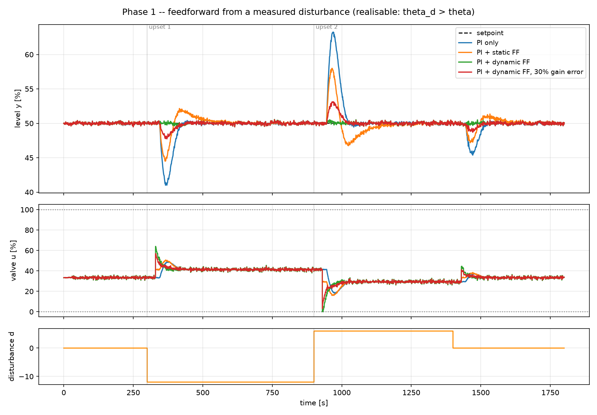
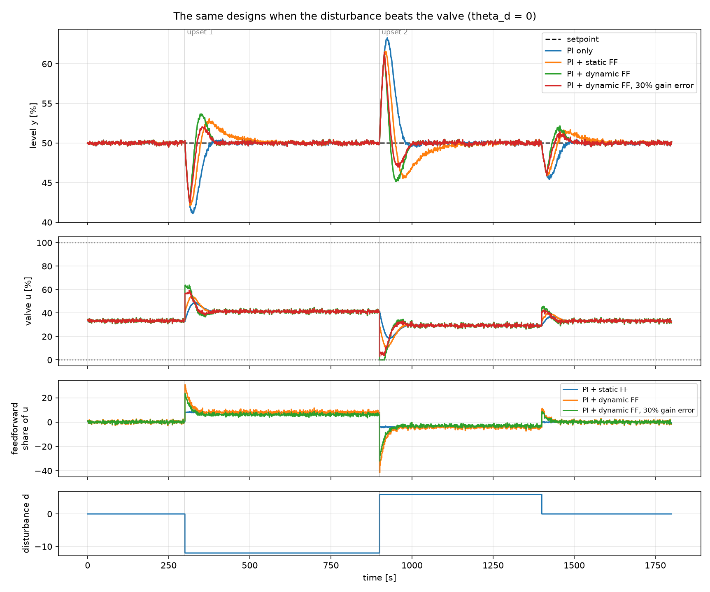

# 8. Feedforward

!!! abstract "Headline"
    Dynamic feedforward from a measured disturbance is worth **5.4× on IAE and
    16× on peak deviation** — more than the entire spread of ten tuning rules
    on the same plant. It is also the cheapest possible "prediction", and its
    three qualifications apply to any model-based scheme.

    **Reproduce:** `python -m experiments.exp08_feedforward`

## The idea

Feedback is reactive by construction: **it cannot act until an error exists.**
If the disturbance is instrumented, that limitation disappears for that
disturbance — the valve can move the moment the upset is *measured*, long
before the controlled variable notices.

The ideal compensator is

\[
u_{ff}(s) = -\frac{G_d(s)}{G_p(s)}\, d(s)
\]

which, for two FOPDT models, is a lead-lag with a gain and a dead time:

\[
u_{ff}(s) = -\frac{K_d}{K_p} \cdot \frac{\tau_p s + 1}{\tau_d s + 1}
\, e^{-(\theta_d - \theta_p)s}
\]

## The setup

The plant has genuinely different paths for the valve and the disturbance:

| path | K | τ | θ |
|---|---:|---:|---:|
| valve → y | 1.5 | 60 s | 15 s |
| disturbance → y | 1.0 | 15 s | 45 s |

So the ideal compensator is a real lead-lag with **30 s of usable advance**:

\[
u_{ff}(s) = -\frac{1.0}{1.5}\cdot\frac{60s+1}{15s+1}\, e^{-30 s}
\]

The disturbance transmitter carries its own noise (σ = 0.4) — feedforward
differentiates that measurement, so pretending it is clean would be flattering.



## The numbers

| design | IAE | peak deviation | TV(u) |
|---|---:|---:|---:|
| PI only | 427 | 8.99 | 138 |
| + static feedforward (gain only) | 362 | 5.49 | 234 |
| + dynamic feedforward (lead-lag + delay) | **79** | **0.56** | **795** |
| + dynamic feedforward, 30 % gain error | 152 | 2.26 | 617 |
| dynamic feedforward, θ_d = 0 (non-causal ideal) | 312 | 7.49 | 805 |

**5.4× on IAE and 16× on peak deviation** — far more than any tuning change on
this plant, and more than the whole spread of the
[tuning shootout](03-tuning-shootout.md).

## Three qualifications, all of which apply to any model-based scheme

### 1. The dynamics carry the benefit, not the gain

Static feedforward — the version that gets deployed when nobody has modelled
the disturbance path — is worth only **1.2×**. Full dynamic compensation is
worth 5.4×.

!!! quote
    Getting the ratio right is not enough; the **timing** is the thing.

This is the single most transferable result on this page. A predictive
controller with a correct steady-state gain and a wrong dynamic model is in
exactly the position of the static-feedforward row.

### 2. It is open loop, so model error is not corrected

A **30 % error in the feedforward gain** gives back half the benefit
(5.4× → 2.8×). Nothing inside the compensator notices or corrects it — and
that ratio $K_d/K_p$ drifts in real life with throughput, moisture and wear.

What saves it is the feedback controller underneath, which still removes the
offset. Feedforward is never deployed alone. The pairing is the industrial
standard: **feedforward for speed, feedback for the truth.**

This is the same argument that applies to any internal model, discussed in
a mismatch study, and it is why [fairness rule 3](../concepts/fairness.md)
exists.

### 3. It costs 5.8× the valve travel

The compensator differentiates a noisy disturbance measurement, and the
lead-lag has a high-frequency gain of $\tau_p/\tau_d = 4$.

Perfect rejection at the cost of a valve that never stops moving is not
automatically a win. Note that the 30 %-gain-error row has *lower* valve
travel than the correct one — it is doing less, less accurately.

## Realisability is not a technicality

The exponent $e^{-(\theta_d - \theta_p)s}$ needs **θ_d ≥ θ_p**: the
disturbance must reach the output *later* than the valve does, or the
compensator would have to act before the disturbance is measured.

The experiment runs the same four designs on a second plant with **θ_d = 0** —
the disturbance beats the valve to the output:



The ideal compensator is now non-causal. The best available design acts 15 s
late and delivers **1.4× instead of 5.4×**. Static feedforward becomes
actively *harmful* in this case (IAE 480 against 429 for feedback alone) —
it moves the valve in the right direction at the wrong time.

!!! tip "Knowing which case you are in is most of the engineering"
    `FeedforwardPID` computes this and says so in its own tuning note:

    ```text
    static gain -0.667, lead-lag (60s / 15s), delayed 30s
    static gain -0.667, lead-lag (60s / 15s); NOT realisable (theta_d < theta_p), acts late
    ```

    The `realisable` flag also lands in `describe()`, so it travels into the
    results record rather than living in someone's head.

## The implementation detail worth copying

Feedforward and feedback share one actuator, so the feedback controller's
anti-windup has to know how much range feedforward has already claimed:

```python
# Give the feedback controller the range that is actually left to it
# once feedforward has taken its share, so its anti-windup stays honest.
self.feedback.u_min = self.u_min - ff
self.feedback.u_max = self.u_max - ff
u_fb = float(self.feedback.compute(y, setpoint, t)[0])
```

Without it, the pair reproduces [article 2](02-integral-windup.md) whenever the
combined demand saturates. The same trick is the recommended fix for the rate
limiter in [Tutorial 5](../tutorials/05-writing-a-controller.md).

## Fairness note

`FeedforwardPID` is the only controller in the project that declares
`uses_measured_disturbance = True`. That declaration is a **modelling claim**
— it asserts the disturbance is instrumented on the real plant — and it is
what causes the harness to pass `d=` to `compute()`.

The disturbance measurement gets its own RNG stream, so switching feedforward
on or off cannot change the measurement-noise realisation seen on `y`.

## The code

```python
plant = Tank(K=1.5, tau=60.0, theta=15.0,
             Kd=1.0, tau_d=15.0, theta_d=45.0,     # the disturbance path
             h0=50.0, noise_std=0.15, seed=7)

ff = FeedforwardPID(
    feedback=pi("PI + dynamic FF"),
    K_p=p["K"], K_d=pd_["K"],
    tau_p=p["tau"], tau_d=pd_["tau"],
    theta_p=p["theta"], theta_d=pd_["theta"],
    dt=scenario.dt, u_min=plant.u_min[0], u_max=plant.u_max[0],
    static_only=False,
)
```

Note `plant.fopdt` and `plant.fopdt_disturbance` are **two different models**.
A feedback controller is tuned on the first; the compensator is the ratio of
the two.

Full script: [`experiments/exp08_feedforward.py`](https://github.com/josepbf/process-control-toolbox/blob/main/experiments/exp08_feedforward.py).

## Next

[Article 9: inverse response](09-inverse-response.md) — the process that
punishes feedback hardest, and where more gain makes it worse.
