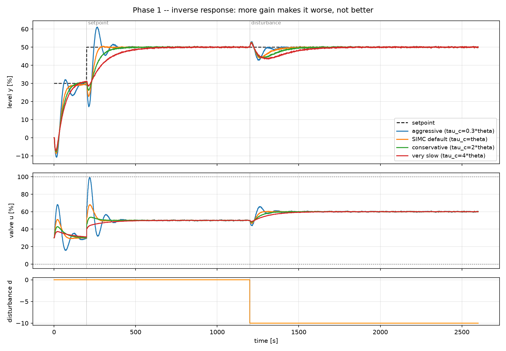
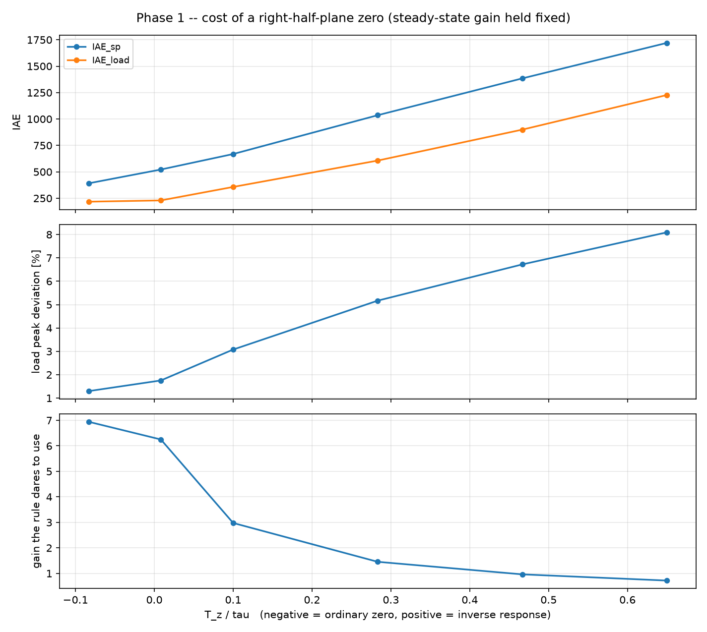

# 9. Inverse response

!!! abstract "Headline"
    A right-half-plane zero. More gain deepens the wrong-way dip **8.6×** —
    the controller is digging its own hole. Sweeping the zero at constant
    steady-state gain costs **10× in usable gain** and 6× in disturbance peak,
    with the plant gain and both time constants untouched. **An RHP zero costs
    what dead time costs.**

    **Reproduce:** `python experiments/exp09_inverse_response.py`

## The process

Boiler drum level, and the same mathematics in any process with two opposing
paths. Opening feedwater must eventually raise the level — but the incoming
water is colder, it collapses the steam bubbles below the surface, and the
level **falls first**.

\[
\begin{aligned}
\tau_s \frac{dx_s}{dt} &= -x_s + K_s\,u(t-\theta) && \text{slow, positive: added mass}\\
\tau_f \frac{dx_f}{dt} &= -x_f + K_f\,u(t-\theta) && \text{fast, negative: bubble collapse}\\
y &= x_s + x_f
\end{aligned}
\]

Equivalently: the transfer function has a zero in the right half plane.

!!! quote "Why this punishes feedback hardest"
    For the first few seconds the measurement moves the **wrong way**. A
    controller that responds to what it sees makes things worse, and
    increasing the gain makes it worse faster.

    An RHP zero puts a hard ceiling on achievable bandwidth that no amount of
    tuning can lift. The only escape is to know in advance that the dip is
    coming — which is what a model-based controller has and a PID does not.

## Part 1: pushing harder digs the hole deeper

Four SIMC tunings of increasing aggressiveness on the same plant: net gain
1.0, RHP zero at T_z = 22.5 s. The half rule folds that zero into an effective
dead time of **27 s**, which is how a classical tuning rule ends up seeing it.



| tuning | Kc | Ms | wrong-way dip | IAE setpoint | overshoot | IAE load | TV(u) |
|---|---:|---:|---:|---:|---:|---:|---:|
| very slow (τ_c=4θ) | 0.46 | 1.19 | **1.5** | 2516 | 2.1 % | 1504 | 191 |
| conservative (τ_c=2θ) | 0.77 | 1.35 | 3.9 | 1641 | 2.2 % | 998 | 318 |
| SIMC default (τ_c=θ) | 1.16 | 1.59 | 7.3 | **1208** | 2.5 % | 749 | 490 |
| aggressive (τ_c=0.3θ) | 1.78 | 2.18 | **12.9** | 1598 | 52.5 % | 589 | 832 |

The **wrong-way dip** is how far the level falls *below its starting value*
after a step **up** in setpoint. It grows monotonically with gain, by **8.6×**
across the range.

!!! danger "This has no analogue on an ordinary process"
    On a minimum-phase plant, a higher gain always *reduces* the initial
    deviation. Here it does the opposite, because the controller's first
    action is a reaction to a movement in the wrong direction — and that
    action makes the movement larger.

    The controller is digging its own hole.

The rest of the picture stays ordinary, and is reported rather than hidden:
higher gain still improves load-disturbance IAE (1504 → 589), at the usual
price in robustness and valve travel. Setpoint IAE is U-shaped with its
minimum at the SIMC default, exactly as in
[the tuning shootout](03-tuning-shootout.md).

## Part 2: the cost scales with the zero

The severity of the inverse response is swept **while holding the
steady-state gain fixed**, so the only thing changing is the zero:

```python
def make_plant(K_fast, **kw):
    """Vary the inverse response while holding the steady-state gain at K_NET,
    so the sweep isolates the zero rather than confounding it with gain."""
    return InverseResponseTank(K_slow=K_NET - K_fast, K_fast=K_fast, ...)
```



| T_z/τ | inverse response? | effective dead time | Kc the rule allows | IAE setpoint | load peak |
|---:|---|---:|---:|---:|---:|
| −0.08 | no | 4.5 s | 6.94 | 391 | 1.30 |
| 0.01 | yes | 5.0 s | 6.25 | 522 | 1.75 |
| 0.10 | yes | 10.5 s | 2.98 | 668 | 3.08 |
| 0.28 | yes | 21.5 s | 1.45 | 1036 | 5.17 |
| 0.47 | yes | 32.5 s | 0.96 | 1385 | 6.72 |
| 0.65 | yes | 43.5 s | 0.72 | 1720 | 8.09 |

**A 10× reduction in usable gain and a 6× worse disturbance peak**, with the
plant gain and both time constants untouched.

## An RHP zero costs what dead time costs

Compare that table with the [dead-time sweep](05-dead-time-sweep.md). The
shapes are the same, and for the same underlying reason: **the inability to
act on information you do not yet have.**

This is why the half rule is right to treat them identically —
`half_rule(..., inverse_zeros=[T_z])` sends the zero entirely into the
effective dead time:

```python
def fopdt_half_rule(self, dt=0.0):
    """The half rule sends a right-half-plane zero entirely into the effective
    dead time -- which is the correct instinct: an inverse response costs you
    the same thing dead time costs you."""
    tau_eff, theta_eff = half_rule(
        [self.tau_slow, self.tau_fast], theta=self.theta,
        inverse_zeros=[self.zero] if self.zero > 0 else [], dt=dt,
    )
```

That is not a numerical convenience. It is the moment where structure the
controller cannot represent gets swept into an effective dead time — the
project's core argument in one function call. See
[Dead time](../concepts/dead-time.md#everything-a-pid-cannot-represent-becomes-dead-time).

## The plant knows what it is

`InverseResponseTank` exposes the two facts a tuning rule needs, computed
rather than asserted:

```python
@property
def has_inverse_response(self) -> bool:
    """Initial slope of the step response is K_s/tau_s + K_f/tau_f; the final
    value is K_s + K_f. Inverse response is exactly the case where those two
    disagree in sign."""

@property
def zero(self) -> float:
    """Time constant T_z of the numerator zero. A *positive* T_z means a
    right-half-plane zero."""
```

The sweep's first row (T_z/τ = −0.08) is a plant with an ordinary
left-half-plane zero — no inverse response, and 10× the usable gain. It is
there as the control case.

## What this sets up

This is **phase 3's non-minimum-phase story in miniature**, isolated on a SISO
loop before loop interaction is layered on top.

The claim that phase 3 will have to test: a model-based controller escapes the
wrong-way dip not by pushing harder but by *not reacting to it* — it knows the
dip is its own doing and rides through it. On this SISO loop that is a modest
win. On a multivariable plant where one loop's inverse response drives
another's measurement, it is expected to be a large one.

## The code

```python
plant = make_plant(K_fast=-0.5, noise_std=0.15, seed=7)
model = plant.fopdt_half_rule()        # {'K': 1.0, 'tau': ..., 'theta': 27.0}

factors = {"aggressive (tau_c=0.3*theta)": 0.3, "SIMC default (tau_c=theta)": 1.0,
           "conservative (tau_c=2*theta)": 2.0, "very slow (tau_c=4*theta)": 4.0}
rules = {label: simc_pi(**model, tau_c=f * model["theta"]) for label, f in factors.items()}

# The wrong-way dip: how far *below* the starting level the process goes
# in the first three minutes after a setpoint step upward.
early = df[(df["t"] >= t0) & (df["t"] <= t0 + 180.0)]
dip = float(30.0 - early["y"].min())
```

Full script: [`experiments/exp09_inverse_response.py`](https://github.com/josepbf/process-control-toolbox/blob/main/experiments/exp09_inverse_response.py).

## Next

That is the end of phase 1. What it all adds up to is on the
[articles index](index.md#the-through-line); what happens next is the
[roadmap](../roadmap.md).
