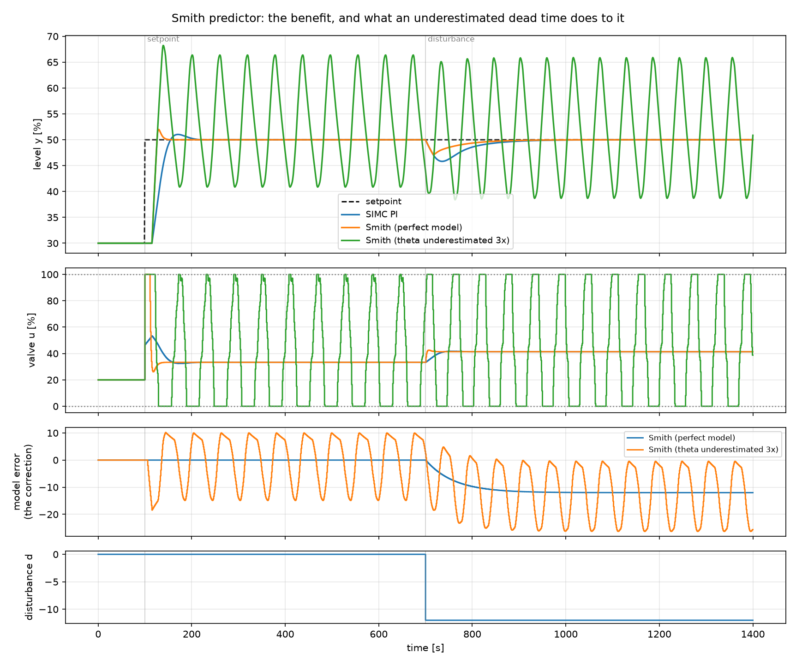
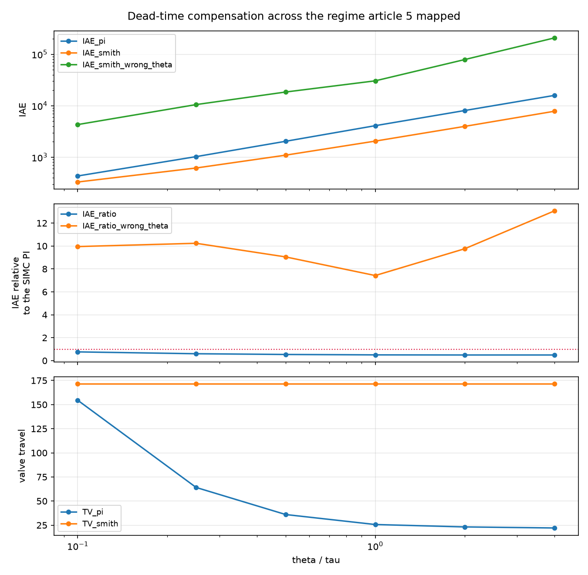

# 10. The Smith predictor

!!! abstract "Headline"
    Dead-time compensation is worth **1.7× on IAE at θ/τ = 0.25, rising to 2.0×
    at θ/τ ≥ 1** — the benefit grows exactly where feedback is worst, which is
    the point of it. It costs 2.7× the valve travel.

    Underestimating θ by a factor of three makes it **7–13× worse than the PI it
    replaced**, across the whole regime. Gain errors do not do this; delay errors
    do. That asymmetry is the single most important thing to know about any
    model-based controller, and it arrives here rather than with MPC.

    **Reproduce:** `python -m experiments.exp10_smith_predictor`

## The idea

[Article 5](05-dead-time-sweep.md) measured the damage: as θ/τ rises, a PI must
be detuned until it is barely controlling anything, because it is always
reacting to news that is already θ seconds old.

Smith's answer (1957) is one line. Write $G(s) = G_0(s)e^{-\theta s}$ with $G_0$
the dead-time-free part, and hand the feedback controller

\[
y_{fb} = \underbrace{\hat{y}_0}_{\substack{\text{what the model says}\\\text{is happening \emph{now}}}}
\;+\; \underbrace{\left(y - \hat{y}_\theta\right)}_{\substack{\text{what the model got wrong,}\\\text{the only news left}}}
\]

If the model is right and nothing else is touching the process, the second term
is identically zero and the PI is controlling $G_0$ — a loop with no dead time,
which can be tuned far more aggressively.

This is also the first controller in the project to carry an internal model, so
it is what puts `models.discrete` under load before anything harder depends on
it. The correction term is published as the `model_error` diagnostic, because it
*is* the structure: watching it is how you tell a predictor that is helping from
one that is quietly falling apart.

## What it buys

The inner PI is tuned as though the only remaining dead time were the sample
time — which is the honest version of "as if there were none", since the sample
time is itself dead time and a rule asked for θ = 0 returns infinite gain.

| θ/τ | PI | Smith (perfect model) | ratio |
|---:|---:|---:|---:|
| 0.10 | — | — | 0.76× |
| 0.25 | 1028.7 | 618.6 | **0.60×** |
| 0.50 | — | — | 0.54× |
| 1.00 | — | — | 0.50× |
| 2.00 | — | — | 0.49× |
| 4.00 | — | — | 0.49× |

The benefit **grows with θ/τ and then saturates near 2×**. That shape is the
result: the predictor is worth most exactly where feedback is worst, which is
what a dead-time compensator is supposed to do and is not something a tuning
rule can deliver.

It costs 2.7× the valve travel at θ/τ = 0.25. Every structural improvement in
this project has cost effort, and the effort column is not optional.

## What it costs when the model is wrong

Here is the same predictor, believing θ is a third of its true value:

| θ/τ | Smith, θ underestimated 3× (relative to the PI) |
|---:|---:|
| 0.10 | 9.95× worse |
| 0.25 | 10.24× worse |
| 0.50 | 9.05× worse |
| 1.00 | 7.42× worse |
| 2.00 | 9.76× worse |
| 4.00 | 13.06× worse |

Not "degraded" — an order of magnitude worse than the classical controller it
replaced, at every ratio, with 4585 units of valve travel against the PI's 64.

The mechanism is not mysterious. The aggressive inner tuning is *protected* by a
cancellation, and the cancellation holds only if the delay is right. Get the
gain wrong and the loop is mistuned; get the delay wrong and the loop is tuned
for a plant that is not there.

!!! danger "The asymmetry worth remembering"
    `test_gain_mismatch_degrades_it_far_more_gently_than_delay_mismatch` pins
    this: a 30 % gain error is a mild penalty, a 3× delay error is a
    catastrophe. On a real plant θ drifts with throughput, line-up and
    fouling — and it is usually the *least* well identified of the three FOPDT
    parameters.

    The engineering conclusion is not "do not use a Smith predictor". It is that
    the inner loop should be tuned for the delay you might actually have, not
    the one you measured on a good day, and that `model_error` should be on a
    trend somebody looks at.

## Why this came before MPC

The [roadmap](../roadmap.md) put dead-time compensation ahead of model
predictive control, and the reason was sequencing rather than tradition. The
Smith predictor needs a discrete internal model and — in its observer-based
variants — a state estimate. So does MPC. Building them here means they are
exercised by a controller simple enough to reason about before anything harder
leans on them: if the MPC then misbehaves, there is one suspect, not two.

It also front-loads the lesson. Everything in
[article 11](11-mpc.md) rests on an internal model, and this article is where
the price of that model being wrong is paid in public.
