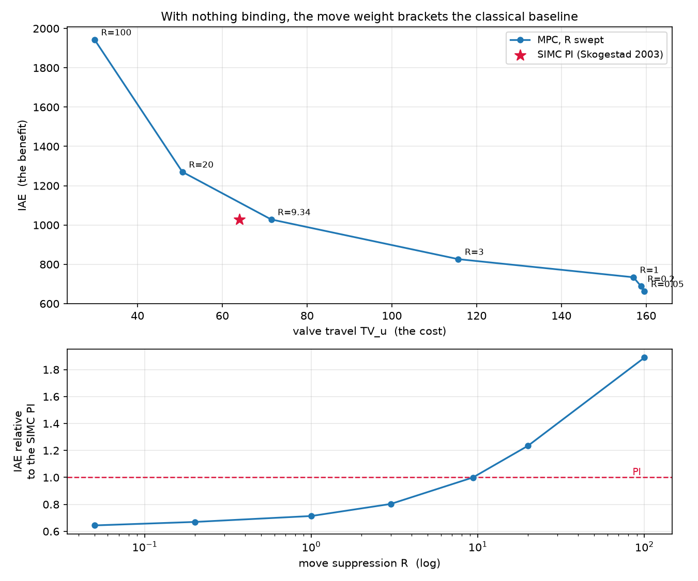
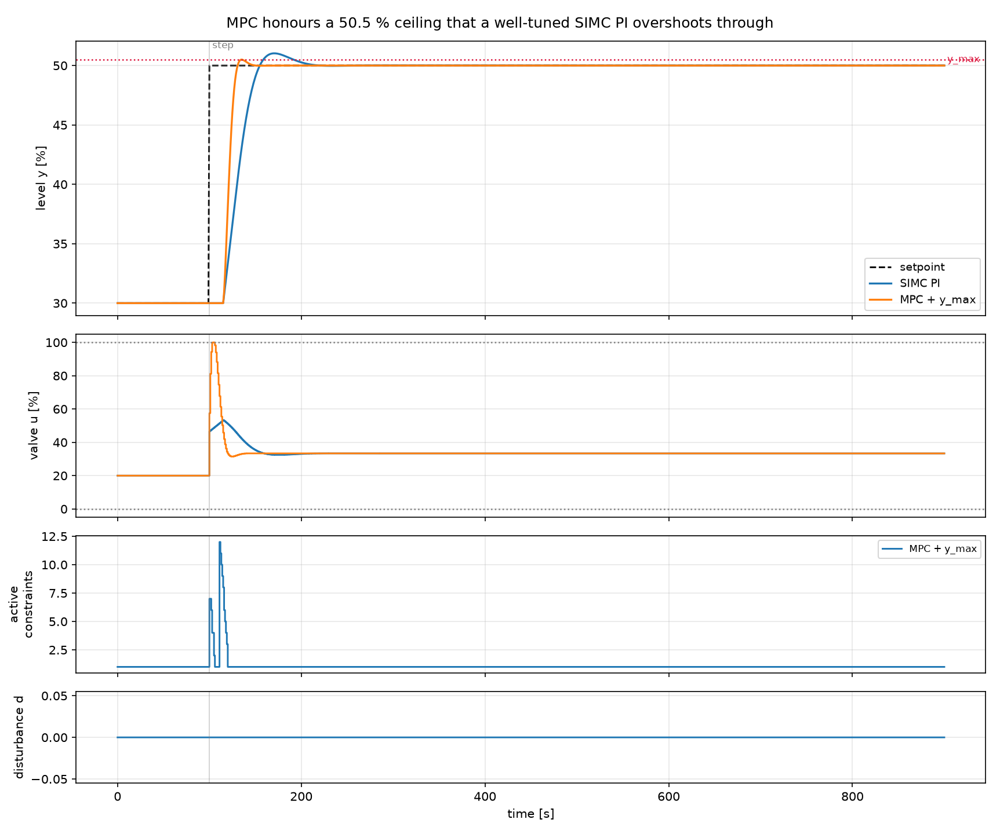
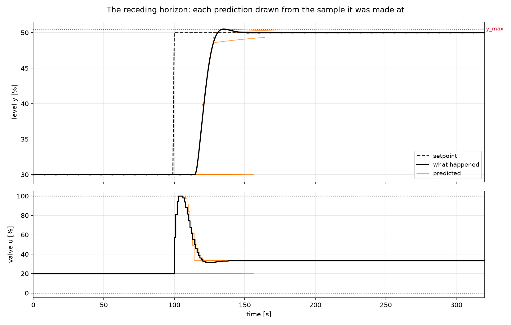

# 11. Model predictive control

!!! abstract "Headline"
    With nothing binding, MPC **ties** a well-tuned SIMC PI — 1028.3 against
    1028.7 on IAE, a difference of 0.04 % — and gets there with *more* valve
    travel. The move-suppression weight brackets the PI in both directions, so
    "MPC beat the PI on IAE" is a statement about a weight somebody chose.

    The structural difference is constraints. Against a 50.5 % ceiling that the
    same well-tuned PI overshoots through on **33 samples**, MPC rides the limit
    and violates it **zero** times. That costs 2.7× the valve travel and ~230×
    the computation per sample.

    **Reproduce:** `python -m experiments.exp11_mpc_constraints`

## What was actually added

MPC was [conditional on the roadmap](../roadmap.md): added only if it fit the
`Controller` abstraction rather than requiring the toolbox to be reshaped around
it. It fits. `Plant` did not change; `simulate()` gained one keyword and *lost*
a branch; the default install is still numpy, scipy, matplotlib and pandas.

The controller solves a condensed QP in the move increments every sample. With
the estimated state $\hat{x}$ and the last move issued $u_{-1}$:

\[
Y = \Psi \hat{x} + \Upsilon u_{-1} + \Theta \,\Delta U
\]

\[
J = (Y - T)^\top \bar{Q} (Y - T) + \Delta U^\top \bar{R}\, \Delta U
  + \rho\,|\varepsilon| + \rho_q \varepsilon^2
\]

so $H = \Theta^\top \bar{Q}\Theta + \bar{R}$ is **constant** and is factorised
once, not once a sample. $T$ is the setpoint repeated across the horizon — or
the previewed trajectory, which is the entire implementation of preview.

Three choices are worth defending, and are defended in
[the concept page](../concepts/mpc.md): increments rather than positions (which
makes offset-free tracking fall out of the parameterisation instead of needing a
target calculation), hard input constraints with **soft** output constraints
(because a run may legitimately start outside a band the plant does not
enforce), and a horizon long enough to cover the settling time in place of a
terminal cost.

## Question 1: with nothing binding, does it beat a PI?

No. And the way it fails to is the interesting part.

Both controllers are tuned from the *same* three FOPDT numbers by a named,
cited rule — SIMC (Skogestad 2003) for the PI, Shridhar & Cooper (1997) for the
MPC. Neither was adjusted by hand.

| | IAE | TV_u | max Δu | overshoot |
|---|---:|---:|---:|---:|
| SIMC PI | 1028.7 | 64.1 | 26.7 | 5.1 % |
| MPC (Shridhar–Cooper) | **1028.3** | 71.5 | **7.2** | **1.4 %** |

Two unrelated tuning rules, two different control structures, one model — and
the same tracking error to four significant figures. That coincidence is the
strongest evidence in this article that both the MPC and the tuning rule are
implemented correctly, in a way that checking either against itself could never
be.

MPC pays about 12 % more valve travel for it, so on the trade-off it is very
slightly the *worse* controller here. It does deliver a much gentler move
profile — a quarter of the PI's largest single step, and a third of the
overshoot — which is worth something on real hardware, but it is not what the
optimiser was asked for.

The lower panel is the point. The move-suppression weight $R$ sweeps MPC from
0.65× the PI's IAE to 1.9×, crossing 1.0 at almost exactly the weight the tuning
rule picks. An MPC with no active constraint *is* a linear controller —
`LinearMPC.linear_gain()` returns the gains, and the QP reports **zero
iterations** at every sample of this run — so there is nothing here for
prediction to do that the PI is not already doing.

!!! warning "The claim this forecloses"
    Quoting a single $R$ turns a tuning choice into what looks like a structural
    result. The frontier is drawn so that cannot happen by accident, and
    `test_the_move_weight_spans_the_pi_so_a_tracking_win_alone_proves_nothing`
    pins it.

## Question 2: with a limit binding, does it respect it?

Yes, and this is the only structural difference.

The ceiling is at **50.5 %**, which is where the well-tuned PI's own 5.1 %
overshoot crosses it — not somewhere only a deliberately bad baseline would go.
[The roadmap's rule](../roadmap.md) is that a new strategy is measured against a
well-structured classical scheme, and a PI detuned into violating would prove
nothing.

| | peak | violations | violation integral | TV_u | solve time |
|---|---:|---:|---:|---:|---:|
| SIMC PI | 51.03 % | 33 | 10.93 | 55.2 | 0.003 ms |
| MPC + `y_max` | **50.50 %** | **0** | **0.00** | 150.5 | 0.716 ms |

The third panel is the mechanism: QP iterations, which for a dual active-set
solver read directly as *how many limits the process forced on me this sample*.
Zero everywhere except the approach to the ceiling.

MPC peaks at 50.500 — it **rides** the constraint rather than backing off it.
A controller that honoured the limit by staying well below it would be a
different and worse controller, and
`test_mpc_rides_the_output_limit_rather_than_backing_far_off_it` is what stops
that passing for success.

The PI is not badly tuned. It simply has no representation of a limit it is not
allowed to cross; nothing in a PI's structure can express one. That is the
whole of what MPC adds.

## Question 3: what did it cost?

**2.7× the valve travel** and **~230× the computation** — 0.716 ms against
0.003 ms per sample, both measured by the harness and both in the table.

Every structural improvement in this project has cost effort: anti-windup,
cascade 2.1×, feedforward 5.8×. MPC is not exempt, and the effort column is not
optional.

The computation figure deserves context rather than alarm. 0.7 ms per sample on
a 1-second loop is 0.07 % duty; the horizon here is 316 samples because the rule
sizes it to the settling time, and the QP has 11 variables against ~650
constraint rows. It is reported because
[fairness rule 5](../concepts/fairness.md) says it is, and because this is the
first controller in the project where it is not negligible.

## The receding horizon

Each prediction is drawn forward from the sample it was made at. Before the
step the controller — which has no preview here — correctly predicts that
nothing will happen. After it, the predictions converge onto what the plant
actually does, which is what a good internal model looks like from the outside.

## What would falsify this

If MPC shows a large win, three things have to be ruled out. All three are
checkable from `df.attrs`, and the experiment asserts them rather than claiming
them:

1. **A better model than the PI's.** It is not: both are built from
   `plant.fopdt`, and the model — including the dead time it actually realised
   after rounding — is recorded in `controller_info["model"]`.
2. **Setpoint preview the PI did not have.** Off here, and
   `df.attrs["uses_preview"]` says so for every run.
3. **Knowledge of the disturbance.** The load is unmeasured for every
   controller. MPC rejects it through an estimated output-disturbance state,
   which is its integral action and is published as `d_hat`.

## What this does not show

- **No nonlinear plant was harmed.** Every plant in this toolbox is linear, so
  the case for nonlinear MPC has not been made here and `do-mpc` has not been
  reached for. The honest order is a genuinely nonlinear process first,
  `LinearMPC` visibly failing on it, and only then CasADi.
- **No terminal cost, no terminal constraint.** The stability argument is a long
  horizon, which is the industrial DMC position and is stated as such rather
  than implied.
- **No claim on peak deviation at high θ/τ.** [Article 5](05-dead-time-sweep.md)
  puts PI within 2 % of the physical floor there. Nothing in this article
  contradicts that, and a result that appeared to would be a result to check.
- **The model is perfect here.** Mismatch is where a model-based controller
  earns its scepticism — [the Smith predictor](10-smith-predictor.md) shows what
  underestimating θ does to a structure that depends on a cancellation.

## The one-line version

MPC did not beat the PI. It did something a PI structurally cannot do, and the
bill came in valve travel and arithmetic.
