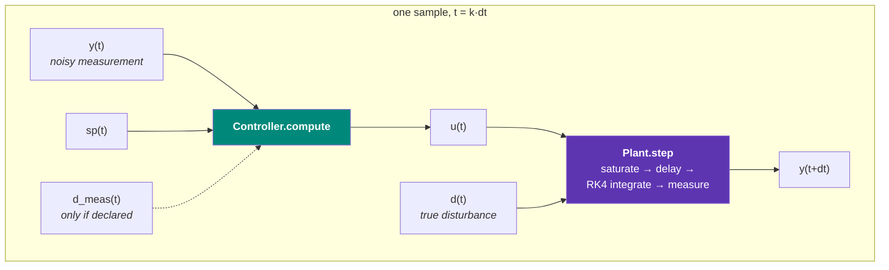

# Architecture

Three objects, one loop. Everything in the project is an instance of one of
them, and every comparison runs through the same simulation function.



## The split, and why it is where it is

The `Plant` is **the truth**. A controller never sees inside it; it observes
only the value returned by `Plant.step()`. Two consequences are enforced
throughout the project, and both are load-bearing rather than stylistic:

!!! abstract "All saturation and all transport delay live in the plant"
    Every controller therefore faces identical physical limits. Any advantage
    a control law shows has to come from *anticipating*
    a constraint — never from being exempt from one. A controller that clipped
    its own output, or that quietly modelled a shorter dead time than the
    process has, would be competing in a different race.

!!! abstract "`reset()` re-seeds the plant's noise generator"
    Run A and run B on the same scenario see a bit-identical noise
    realisation. This is a fairness requirement, not a nicety: on a
    well-controlled loop the residual tracking error is *at* the noise floor,
    so two controllers judged against different noise draws are being scored
    partly on luck.

### Plant

Subclasses implement continuous-time dynamics and an output map:

```python
def dynamics(self, x, u, d) -> np.ndarray:   # xdot = f(x, u, d)
def output(self, x) -> np.ndarray:           # y = g(x); defaults to the full state
```

Everything else — integration, saturation, three independent delay lines,
measurement noise — is handled once, in [`Plant`](../reference/plants.md). The
`u` handed to `dynamics` is the *delayed, saturated* input that actually
reaches the process, not the raw controller output.

Integration is fixed-step RK4 with `n_substeps` (default 4) sub-steps per
sample, under a zero-order hold on the input.

### Controller

```python
def compute(self, y, setpoint, t) -> np.ndarray:   # the move for this sample
def reset(self) -> None:                           # clear integrators, histories, warm starts
```

Plus three declarative attributes that the harness records with every run:

| attribute | meaning |
|---|---|
| `name` | label used in plots and metric tables |
| `tuning_note` | how this controller was tuned, with its citation |
| `uses_measured_disturbance` | whether it reads an instrumented disturbance |

A controller is allowed, and for model-based schemes required, to carry its own
**internal model** of the process. That model is not required to match the
plant, and the interesting results in this project come from the gap between
them.

### Scenario

A `Scenario` fixes the sample time, the run length, the setpoint programme,
the disturbance programme, the RNG seed, and a set of named time windows for
reporting. Signals are plain callables of time, built with `constant()`,
`staircase()` or `pulse()`.

Windows matter more than they look. A regulatory loop has exactly two jobs —
track a setpoint, reject a load — and they are in tension. Scoring them in one
lump hides the trade; reporting them in separate windows keeps it visible.

## The timing convention

Per sample $k$, at $t = k \cdot dt$:

1. the controller sees the measurement $y(t)$ taken at the top of the sample;
2. it returns $u(t)$, held constant over $[t, t+dt)$ — zero-order hold;
3. the plant integrates one $dt$ under $u(t)$ and the disturbance $d(t)$;
4. a new noisy measurement $y(t+dt)$ is taken.

The logged row for time $t$ therefore holds **the measurement the controller
acted on and the move it made in response** — the causal pairing you want when
reading the plots. A row is also appended after the final step, so the trace
ends where the process actually ended.

Inside `Plant.step()` the order is fixed and is worth memorising:

```text
saturate  →  delay  →  integrate (ZOH)  →  measure (+ noise)  →  measurement delay
```

## The DataFrame every run produces

`simulate()` returns one tidy row per sample:

| column | meaning |
|---|---|
| `t` | time [s] |
| `y`, `y0`, `y1`, … | measured output(s) — suffixed when the plant is multi-output |
| `sp` | setpoint |
| `u` | manipulated variable actually requested |
| `d` | true disturbance applied to the plant |
| `d_meas` | disturbance *measurement* handed to feedforward controllers (noisy) |
| `violation` | signed magnitude outside the declared output band |
| `violated` | boolean form of the same |
| `solve_time` | wall-clock seconds spent inside `compute()` |

`solve_time` is logged for **every** controller, including the trivial ones.
Recording that a PID takes 3 µs is not interesting on its own; it becomes
interesting the moment it sits in the same column as an optimisation-based
controller's solve time, which is why the column exists from experiment 1.

Run metadata lands in `df.attrs`: controller name, the full `describe()`
record, plant repr, scenario name, `dt`, seed, and the actuator and output
limits. That is what makes a saved run self-describing — the tuning rule
travels with the numbers it produced.

## Where a comparison actually happens

```python
runs = run_all(plant, {"A": ctrl_a, "B": ctrl_b}, scenario)
table = summarize(runs, windows=scenario.windows)
```

`run_all` deep-copies the plant for each controller and passes the same seed,
so the two runs differ in exactly one thing: the control law.
