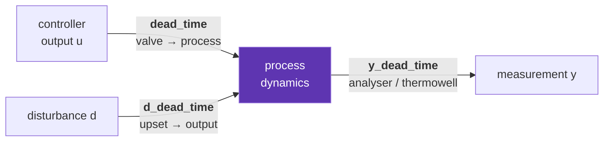

# Dead time

Dead time is the central difficulty of process control, and the reason this
project exists. A controller cannot react to what it has not yet seen, and no
amount of tuning creates information that has not arrived.

## Why θ/τ is the number to look at

For a first-order-plus-dead-time (FOPDT) process

\[
G(s) = \frac{K\,e^{-\theta s}}{\tau s + 1}
\]

the ratio $\theta/\tau$ — dead time over lag — is the single best predictor of
how hard the loop is to control:

| θ/τ | regime | what happens |
|---|---|---|
| < 0.2 | lag-dominant | almost any tuning works; the loop is forgiving |
| 0.2 – 1 | balanced | tuning starts to matter; this is the workhorse test case |
| > 1 | **dead-time-dominant** | gain must be cut hard to stay stable; feedback alone runs out of road |

A cement mill or a kiln lives above 1. That is exactly where dead-time
compensation (Smith predictor) and prediction (MPC) are supposed to earn their
keep — and [experiment 5](../articles/05-dead-time-sweep.md) measures how much
room they actually have.

The mechanism is phase, not gain. A transport delay contributes
$-\omega\theta$ radians of phase at every frequency while leaving the
magnitude untouched, so it eats phase margin without giving any warning in the
gain plot. Push the gain up and the Nyquist curve walks straight into the −1
point.

## The three delay paths

Dead time occurs in three physically distinct places, and the project models
all three independently — because their *relationship* decides what is
possible.



| path | attribute | what it is physically |
|---|---|---|
| manipulated | `dead_time` | transport lag between valve and process — a pipe run, a conveyor |
| disturbance | `d_dead_time` | when the upset reaches the output |
| measurement | `y_dead_time` | analyser or thermowell reporting lag |

Two results turn entirely on the relationship between them:

!!! example "Feedforward is realisable only when θ<sub>d</sub> ≥ θ<sub>p</sub>"
    The ideal compensator is $-G_d(s)/G_p(s)$, which contains
    $e^{-(\theta_d - \theta_p)s}$. If the disturbance reaches the output
    *before* the valve can, that exponent is positive — the compensator would
    have to act before the disturbance is measured. The design is non-causal.
    [Experiment 8](../articles/08-feedforward.md) runs both cases: 5.4× when
    realisable, 1.4× when not.

!!! example "Cascade pays for itself because the secondary measurement is the undelayed one"
    In `CascadeProcess`, the primary (temperature, quality) is reported 20 s
    late and the secondary (flow) is not. That asymmetry, not the dynamics, is
    the practical reason a cascade earns its extra transmitter.
    [Experiment 7](../articles/07-cascade.md).

Implementation: each path is a FIFO of past values, `deque`-based, sized
`round(dead_time / dt)` samples. The delay line is *primed* with the input
that holds the initial steady state, so a run does not start with a hidden
step buried in the pipeline. `dt` may not change mid-run; the plant raises if
it does.

## The physical floor

After a load step, no controller can affect the output for $\theta$ seconds,
because its move takes that long to arrive. The unavoidable peak deviation is
therefore at least

\[
|K_d \, d| \left(1 - e^{-\theta/\tau}\right)
\]

This is plotted as a dashed line in [experiment 5](../articles/05-dead-time-sweep.md).
The gap between the achieved peak and that line is what better control could
in principle recover; where the two meet, the loss is physics.

The finding that shapes the whole project: as dead time takes over, PI gets
**closer** to the floor on peak deviation — 2.21× the floor at θ/τ = 0.05, but
1.02× at θ/τ = 4 — while scaled IAE gets 8× worse. Dead time costs two
different things:

- the **peak** deviation, which is physics, and which no controller recovers,
  MPC included;
- the **recovery**, which is control, and where all the remaining headroom is.

Any later claim that a Smith predictor or MPC "handles dead time better" has
to show up in the second of those, not the first.

## Everything a PID cannot represent becomes dead time

Skogestad's **half rule** reduces a high-order model to the two-parameter
FOPDT form that every classical tuning rule needs. Given lags sorted
largest-first, the largest *neglected* lag is split in half — one half added
to the retained time constant, the other to the effective dead time — and
everything smaller goes entirely into the dead time:

\[
\tau_{\text{eff}} = \tau_1 + \frac{\tau_2}{2}, \qquad
\theta_{\text{eff}} = \theta + \frac{\tau_2}{2} + \sum_{i\ge3}\tau_i
+ \sum_j T_{z,j} + \frac{dt}{2}
\]

Note what is in that last sum: **right-half-plane zeros**. The half rule folds
an inverse response into an effective dead time, and that is the correct
instinct rather than a convenient approximation — an RHP zero costs you the
same thing dead time costs you, the inability to act on information you do not
yet have. [Experiment 9](../articles/09-inverse-response.md) measures the
equivalence: a 10× reduction in usable gain from the zero alone, with the
plant gain and both time constants untouched.

This is also a preview of the project's core argument. Everything a PID cannot
represent about the process gets swept into an effective dead time — and dead
time is precisely what feedback handles worst.

```python
from process_control.tuning.rules import half_rule

tau_eff, theta_eff = half_rule([40.0, 20.0, 10.0], theta=0.0, dt=1.0)
# tau_eff = 50.0, theta_eff = 20.5
```
