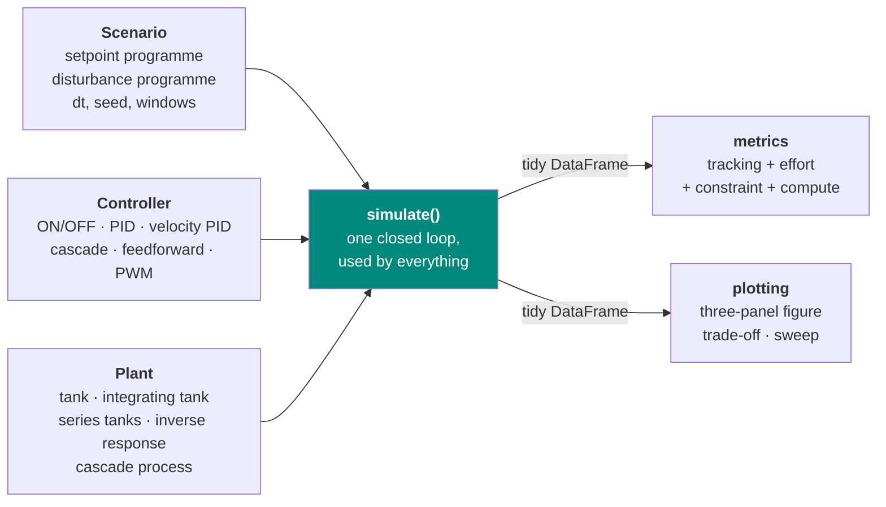

# Process Control Toolbox

Model Predictive Control implemented from scratch and benchmarked, fairly and
quantitatively, against the classical ladder — ON/OFF, PID, cascade,
feedforward, Smith predictor, LQR — on processes with the features that
actually make industrial control hard: **long dead time, loop interaction,
recycle, and hard actuator limits**.

The goal is understanding and a defensible comparison, not a production
library. Implementations are explicit and readable in preference to clever.

!!! info "Project status"
    **Phase 1 complete and extended.** Harness, five plants, six controllers,
    thirteen tuning rules with frequency-domain robustness analysis, relay
    auto-tuning, and nine reproducible experiments (119 tests). Phase 2 —
    linear MPC by hand — has not started. See the [roadmap](roadmap.md).

## The question this project exists to answer

There is a very large literature comparing MPC against PID, and a great deal
of it is worthless, for one structural reason: it is trivial to make MPC look
brilliant by tuning the PID badly. This project's response is to fix the rules
before the contenders arrive.

-   :material-scale-balance:{ .lg .middle } __Every baseline is tuned by a named rule__

    ---

    Thirteen published tuning rules, each cited, each recorded in the results
    table alongside the run. No silent hand-tuning, ever.

    [:octicons-arrow-right-24: Tuning rules](concepts/tuning-rules.md)

-   :material-factory:{ .lg .middle } __All physical limits live in the plant__

    ---

    Saturation and transport delay belong to the process, not the controller.
    MPC's advantage has to come from *anticipating* a constraint, never from
    being exempt from one.

    [:octicons-arrow-right-24: Architecture](concepts/architecture.md)

-   :material-chart-line:{ .lg .middle } __Tracking is reported with effort__

    ---

    Every comparison carries a tracking metric **and** a control-effort
    metric. Tracking bought with violent valve movement is not a win — in a
    real plant it destroys the actuator.

    [:octicons-arrow-right-24: Metrics](concepts/metrics.md)

-   :material-flask:{ .lg .middle } __Losses get reported too__

    ---

    Scenarios where the sophisticated method does *not* win are written up in
    the same detail as the ones where it does. Cascade is 7.7× better on one
    disturbance and 0.9× on another; both numbers are published.

    [:octicons-arrow-right-24: Fairness rules](concepts/fairness.md)

## Where to start

| If you want to… | Go to |
|---|---|
| install it and run something | [Getting started](getting-started.md) |
| learn the library by building a loop | [Tutorials](tutorials/index.md) |
| understand *why* it is built this way | [Concepts](concepts/index.md) |
| read the experimental results and what they mean | [Articles](articles/index.md) |
| look up a class or a function | [API reference](reference/index.md) |
| decode a piece of process-control jargon | [Glossary](glossary.md) |

## The shape of the code in one diagram

The `Plant` is the truth and owns every physical limit. The `Controller` sees
only a noisy measurement. `simulate()` is the single closed loop that every
comparison in the project runs through — nobody gets a different integrator, a
different sample time, or a different noise stream.

## Headline results so far

| experiment | headline |
|---|---|
| [ON/OFF vs PID](articles/01-onoff-vs-pid.md) | ON/OFF limit-cycles at ±18 % with a period of ~4θ; SIMC PI settles without offset |
| [Integral windup](articles/02-integral-windup.md) | back-calculation is worth **16×** on recovery IAE — a structural fix, not a tuning one |
| [Tuning shootout](articles/03-tuning-shootout.md) | ten PI rules scored on performance **and** robustness Ms; SIMC sits at the knee |
| [Relay auto-tuning](articles/04-relay-autotune.md) | the industrial autotune recovers Pu to +7 % and under-gains by 24 % — and errs safe |
| [Dead-time sweep](articles/05-dead-time-sweep.md) | usable loop gain falls **80×** while the peak deviation approaches a floor no controller can beat |
| [Averaging level](articles/06-averaging-level.md) | tight and averaging level control rank **opposite** depending on the objective |
| [Cascade](articles/07-cascade.md) | **7.7×** on the disturbance it was designed for, 0.9× on the one it was not |
| [Feedforward](articles/08-feedforward.md) | **5.4×** on IAE, 16× on peak — and what a 30 % gain error costs |
| [Inverse response](articles/09-inverse-response.md) | more gain deepens the wrong-way dip **8.6×**; an RHP zero costs what dead time costs |

The complete running record, with every table, is in
[`FINDINGS.md`](https://github.com/josepbf/process-control-toolbox/blob/main/FINDINGS.md).

## What phase 1 has already established

1. **The PID baseline is SIMC (τc = θ)**, with AMIGO as the robust
   alternative — chosen on stated grounds *before* any MPC result exists.
2. **Structure beats tuning, repeatedly.** Anti-windup 16×, cascade 7.7×,
   feedforward 5.4× — every one larger than the entire spread of ten tuning
   rules on the same plant. The interesting question for MPC is therefore not
   "can it beat a PID" but "can it beat a *well-structured* classical scheme".
3. **The peak deviation after a disturbance is mostly physics.** In the
   dead-time-dominant regime PI is already within 2 % of the theoretical floor.
   MPC's opportunity is in the recovery, in constraint handling, and in
   multivariable coordination — not in the peak.
4. **Every improvement so far cost valve travel.** No comparison in this
   project is reported without the effort column.
